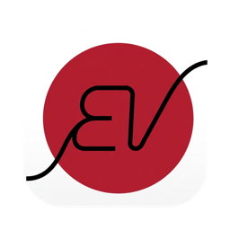
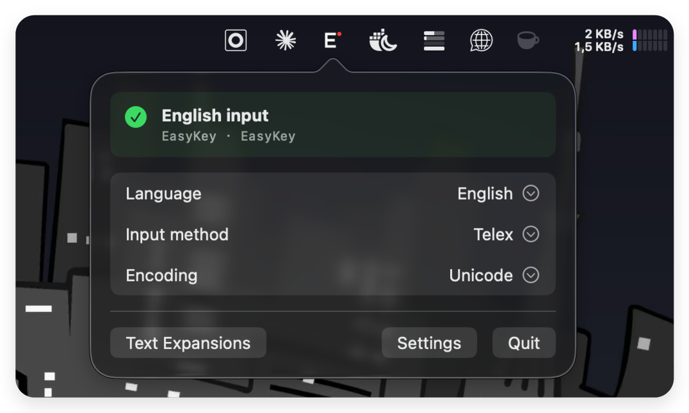
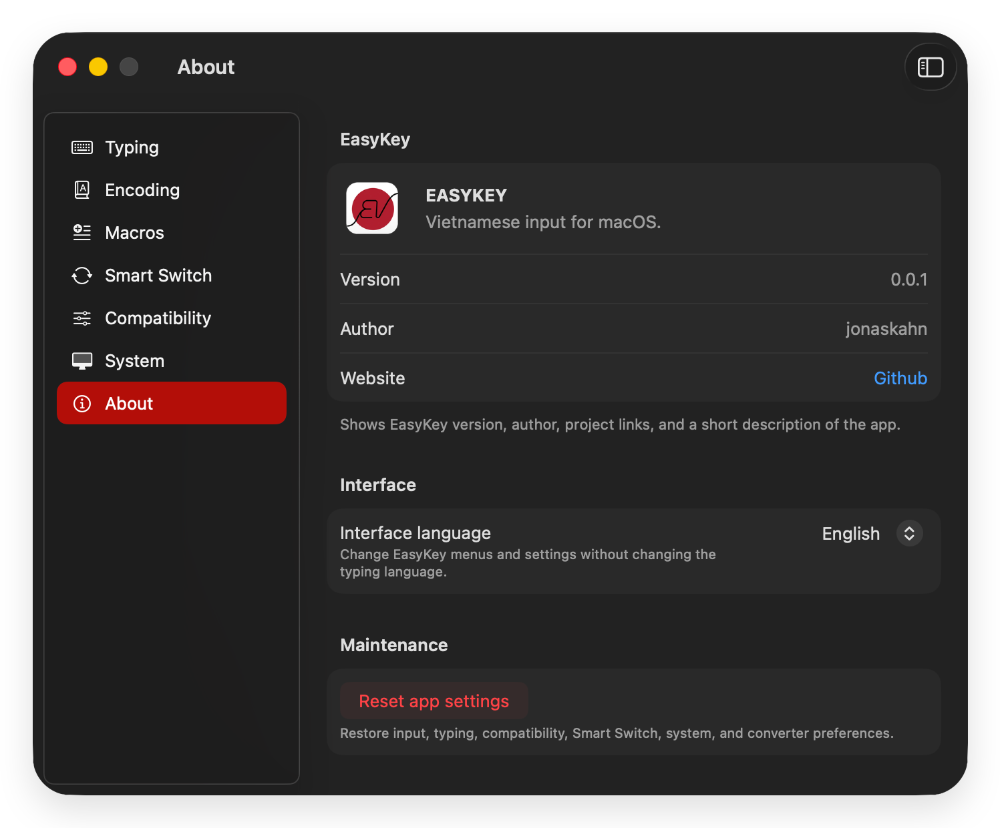

<p align="center">
  <br>
  <strong>EasyKey</strong><br><br>
  <a href="https://github.com/jonaskahn/EasyKey/releases/latest"></a>
  <a href="https://github.com/jonaskahn/EasyKey/actions/workflows/ci.yml"></a>
  <a href="https://github.com/jonaskahn/EasyKey/actions/workflows/ci.yml"></a>
  <a href="https://github.com/jonaskahn/EasyKey/releases/latest"></a>
  <br><br>
  <i>Fast, private Vietnamese typing for macOS | Telex · VNI · encodings · macros · Smart Switch</i>
</p>

---

EasyKey is a native Vietnamese input utility built for accurate typing across macOS. It combines a clean-room Telex and VNI engine with per-application preferences, text expansion, legacy encoding support, and practical compatibility controls.

```text
vieejt nam  →  việt nam
```

Typing is processed locally. EasyKey uses the macOS Accessibility API and a `CGEvent` tap instead of Input Method Kit. Apple Translation is on-device on macOS 15 or later. Optional cloud translation runs only after you choose **Translate** and sends submitted source text directly to your selected provider. EasyKey includes no analytics or telemetry.

## ✨ Highlights

- ⌨️ **Flexible input** — Telex, VNI, and Simple Telex with configurable typing rules
- 🔤 **Complete encoding support** — Unicode, Unicode Combining, TCVN3, VNI-Windows, and CP1258
- 🧩 **Powerful macros** — Create, search, enable, import, and export trigger-based expansions
- 🔀 **Smart Switch** — Remember language and optional encoding choices for each application
- 🔄 **Text converter** — Preview, copy, or transform clipboard text across supported encodings
- 📋 **Clipboard manager** — Opt-in, private, searchable clipboard history opened with Control-Option-V; optional AES-GCM encrypted persistence
- 🛠️ **Application compatibility** — Dedicated compatibility and ignore lists, including Chromium-oriented controls
- ⌨️ **Custom shortcuts** — Switch languages, control the engine, and convert clipboard content from the keyboard
- 🚀 **Secure updates** — Sparkle 2 update delivery with EdDSA signature verification
- 🌐 **Bilingual interface** — English and Vietnamese localization through String Catalogs
- 🌍 **Explicit translation** — Apple on-device translation on macOS 15+, or opt-in direct requests to configured cloud providers

## 🔒 Private by Design

EasyKey performs keyboard transformation and preference storage on your Mac. General keyboard input is not translated or uploaded. Apple Translation runs locally on macOS 15 or later. Cloud translation is optional: in the translation source editor or Option+A popup, when you type or paste, the configured provider receives source text after the selected idle delay. Each edit restarts the timer. Pressing Return translates immediately. EasyKey does not proxy cloud requests through an EasyKey service.

Cloud-provider credentials are stored in macOS Keychain as device-only, non-synchronizing items. EasyKey does not persist source text, translation results, prompts, or translation history. Providers process submitted text under their own terms and may retain or use request data according to account tier and provider settings. Provider data-handling links are shown in Translation settings and in first-use disclosure. These providers do not sponsor or endorse EasyKey.

Separate network activity includes provider credential validation and signed Sparkle update checks. Credential validation does not submit source text. No usage data is collected. See [Privacy](./PRIVACY.md) for exact data flows and reviewed provider links.

Accessibility permission is required because EasyKey observes and transforms keyboard events system-wide. The permission can be reviewed or revoked at any time in **System Settings → Privacy & Security → Accessibility**.

The **clipboard manager is off by default** and must be explicitly enabled. When enabled it keeps a local history of copied text, URLs, images, and file references. Content marked concealed, transient, or auto-generated (used by password managers) is always rejected and never recorded. History lives only in memory unless you turn on **Keep history after restart**, which stores it AES-GCM encrypted on the device with a Keychain key (unlocked-this-device-only, never synchronized); disabling that option deletes the stored data. The ignored-applications list is a best-effort convenience — macOS does not report the source application of a clipboard change, so it is not a security boundary. Clipboard content is never written to logs and never leaves the device.

## 📸 Screenshots

| Menu bar | Settings |
|----------|----------|
|  |  |

## 📋 Requirements

### Using EasyKey

- macOS 14.0 Sonoma or later
- Apple silicon or Intel Mac
- Accessibility permission

### Building from Source

- Xcode 15 or later
- Git and command-line developer tools
- SwiftLint and SwiftFormat are optional

## 📦 Installation

1. Download the latest universal DMG from [GitHub Releases](https://github.com/jonaskahn/EasyKey/releases/latest).
2. Open `EasyKey-<version>-universal.dmg`.
3. Drag **EasyKey** into **Applications**.
4. Launch EasyKey and grant Accessibility access when prompted.

Current public builds are universal and ad-hoc signed, but not Developer ID notarized. On first launch, macOS may block the application:

1. Control-click **EasyKey** in **Applications**, then choose **Open**.
2. Confirm **Open** in the security dialog.
3. If needed, open **System Settings → Privacy & Security** and choose **Open Anyway**.

EasyKey runs primarily from the menu bar. Typing transformation remains unavailable until Accessibility access is granted.

## 🛠️ Build from Source

```bash
git clone https://github.com/jonaskahn/EasyKey.git
cd EasyKey
make build
make test
make run
```

Create a local universal DMG without signing or notarization credentials:

```bash
make local-dmg
```

Output: `build/EasyKey-<version>-universal.dmg`

Direct Xcode build:

```bash
xcodebuild \
  -project EasyKey.xcodeproj \
  -scheme EasyKeyApp \
  -configuration Debug \
  -destination "platform=macOS"
```

## 🧰 Make Commands

Run `make` or `make help` to display the complete command reference.

### Development

| Command | Purpose |
|---------|---------|
| `make build` | Build the debug application |
| `make run` | Build and launch EasyKey |
| `make test` | Run unit and UI tests with code coverage |
| `make coverage` | Run tests and print the coverage summary |
| `make lint` | Run SwiftLint when installed |
| `make format` | Run SwiftFormat when installed |

### Quality and Cleanup

| Command | Purpose |
|---------|---------|
| `make qa` | Run the full QA gate and verify generated artifacts |
| `make clean` | Remove build artifacts |
| `make clean-local` | Quit EasyKey and remove local app and test data |
| `make clean-all` | Remove build artifacts and local data |

### Release

| Command | Purpose |
|---------|---------|
| `make release` | Build an unsigned universal Release application |
| `make local-dmg` | Package an ad-hoc signed universal DMG |
| `make archive` | Create a signed archive using Developer ID configuration |
| `make export` | Export the application from an archive |
| `make verify-arch` | Verify arm64 and x86_64 architectures |
| `make verify-release` | Run release integrity checks |
| `make dmg` | Build a signed universal distribution DMG |

Signed distribution requires Developer ID, notarization, and Sparkle release credentials. See [RELEASE.md](./RELEASE.md) for the complete release process.

## 📁 Architecture

```text
EasyKey/
├── EasyKeyApp/             # SwiftUI and AppKit application shell
│   ├── Features/           # Onboarding and settings feature slices
│   ├── Coordination/       # Menu bar, windows, login item, and app wiring
│   └── Settings/           # Observable settings integration
├── EasyKeyKit/             # macOS keyboard-service adapters
│   └── Keyboard/           # Event tap, input pipeline, and diagnostics
├── EasyEngineCore/         # Framework-independent domain logic
│   ├── Engine/             # Transformation rules, tones, and encodings
│   ├── Settings/
│   ├── Macros/
│   ├── SmartSwitch/
│   ├── Converter/
│   └── Diagnostics/
├── EasyKeyLoginHelper/     # Launch-at-login helper
├── EasyKeyTests/           # Unit and architecture fitness tests
├── EasyKeyUITests/         # User-interface tests
├── Fixtures/               # Behavioral test fixtures
├── Scripts/                # QA, packaging, and release automation
└── EasyKey.xcodeproj/
```

Dependencies point inward:

```text
EasyKeyApp → EasyKeyKit → EasyEngineCore
```

- **EasyEngineCore** contains the independent typing domain and has no AppKit, SwiftUI, or Combine dependency.
- **EasyKeyKit** adapts domain behavior to macOS event taps, keyboard pipelines, and synthesis.
- **EasyKeyApp** provides feature-oriented UI, coordination, localization, settings, and update delivery.

Engineering practices and architectural rules are documented in [CONVENTIONS.md](./CONVENTIONS.md).

## 🧪 Quality

- CI-enforced 95% line-coverage threshold, excluding the login helper
- Unit, UI, behavioral fixture, and architecture fitness tests
- Universal arm64 and x86_64 release verification
- SwiftLint and SwiftFormat support
- Public API documentation and production force-unwrap restrictions

```bash
make test
make qa
```

## 📄 License and Notices

EasyKey is available under the [MIT License](./LICENSE).

This project is an independent clean-room implementation based on public typing conventions, character standards, and observed behavior. See [NOTICE](./NOTICE) for the implementation statement and [THIRD_PARTY_NOTICES.md](./THIRD_PARTY_NOTICES.md) for third-party acknowledgements.
