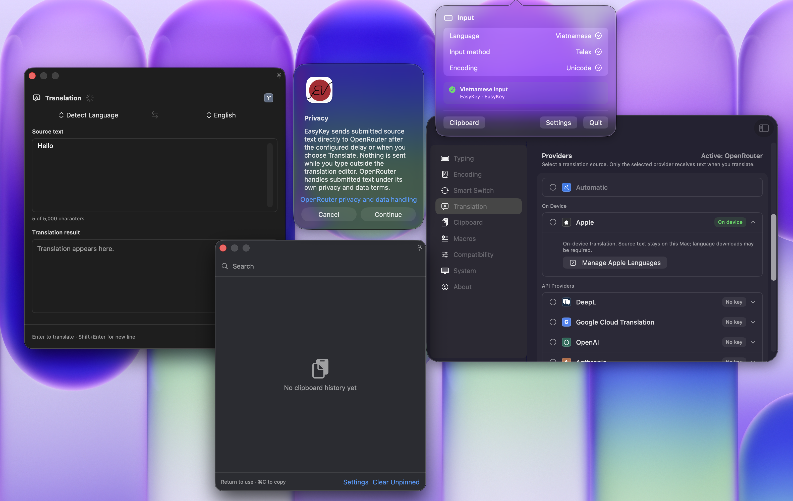

<p align="center">
  <br>
  <strong>EasyKey</strong><br><br>
  <i>Fast, private Vietnamese typing for macOS</i><br><br>
  <a href="https://github.com/jonaskahn/EasyKey/releases/latest"></a>
  <a href="https://github.com/jonaskahn/EasyKey/releases/latest"></a>
  <a href="https://github.com/jonaskahn/EasyKey/actions/workflows/ci.yml"></a>
  <a href="https://github.com/jonaskahn/EasyKey/actions/workflows/ci.yml"></a>
</p>

---

EasyKey lives in your menu bar: type Vietnamese in any app, keep a private clipboard history, expand macros, and translate — all processed locally on your Mac.

```text
vieejt nam  →  việt nam
```

## 🚀 Install

1. Download the latest DMG from [GitHub Releases](https://github.com/jonaskahn/EasyKey/releases/latest).
2. Open the DMG, drag **EasyKey** into **Applications**, and launch it.
3. Grant **Accessibility** access when prompted (required for system-wide typing).

> If macOS blocks the app: Control-click **EasyKey** → **Open**, or use **System Settings → Privacy & Security → Open Anyway**.

## 🖊️ Usage

| Shortcut | Action |
|----------|--------|
| `⌥` + `Z` | Switch input language |
| `⌥` + `V` | Open clipboard manager |
| `⌥` + `C` | Open translate panel |

All shortcuts are configurable in Settings.

### ⌨️ Vietnamese typing

Pick an input method in **Settings → Typing** (Telex, Simple Telex, or VNI; Simple Telex is the default) and just type — Vietnamese is composed in any app. EasyKey remembers the language and encoding per app.

### 📋 Clipboard manager

Copy anything — text, URLs, images, file references — then press `⌥V` to search, pin, or paste from recent history. Off by default: enable it in **Settings → Clipboard**. History stays in memory unless you opt into encrypted on-device persistence.

### 🌍 Translation

Press `⌥C`, type or paste text, and get a translation in place. Apple Translation runs fully on-device on macOS 15+; or connect a cloud provider (DeepL, Google, OpenAI, Anthropic, Gemini, OpenRouter, Groq) in **Settings → Translation**.

### 🧩 Macros

In **Settings → Macros**, set a trigger such as `addr` and an expansion; typing the trigger expands it in any app.

### 🛠️ Compatibility

In **Settings → System**, pause EasyKey in specific apps or force a language per app — useful for terminals, games, or apps that need literal keystrokes.

## 📸 Screenshots

| Apps |
|-------|
|  |

## 🔒 Private by Design

Everything is processed on your Mac — no analytics, no telemetry, no typing logs. Cloud translation is opt-in and goes directly to the provider you choose; credentials live in device-only Keychain; clipboard persistence, if enabled, is AES-GCM encrypted.

See [the security section](./docs/security/README.md) for the permission footprint and policy details.

## 📋 Requirements

- macOS 14.0 Sonoma or later (Apple silicon or Intel)
- Accessibility permission

> **Known issue:** typing in Spotlight (`⌘Space`) can look briefly broken right after opening it, then self-correct — a macOS detection-timing limitation, not an EasyKey defect. See [reference](./docs/reference.md).

## 🛠️ For Developers

[Build and test from source](./docs/engineering.md) · [Distribution](./docs/operations/distribution.md) · [Engineering conventions](./docs/_archive/rulebook.md) · [Exact Telex rules](./docs/_archive/telex.md)

## 📄 License and Notices

EasyKey is available under the [MIT License](./LICENSE). This project is an independent clean-room implementation based on public typing conventions, character standards, and observed behavior. See [NOTICE](./NOTICE) for the implementation statement and [THIRD_PARTY_NOTICES.md](./docs/_archive/THIRD_PARTY_NOTICES.md) for third-party acknowledgements.

Inspired by [OpenKey](https://github.com/tuyenvm/OpenKey) by Mai Vũ Tuyên and [UniKey](https://www.unikey.org/) by Phạm Kim Long — heartfelt thanks to both authors for their pioneering work on Vietnamese typing software.
