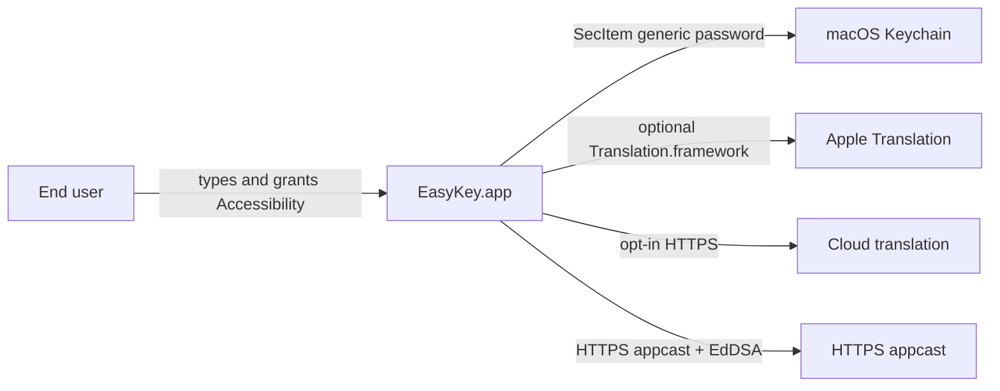
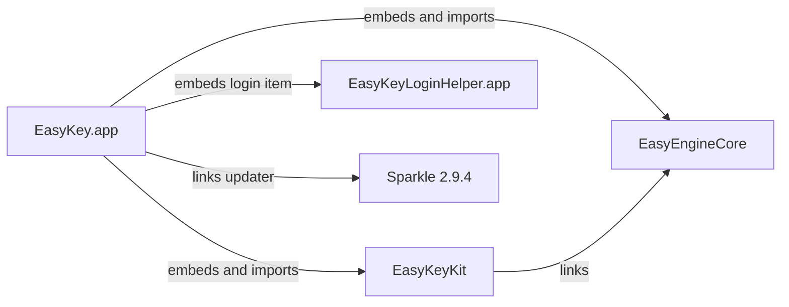
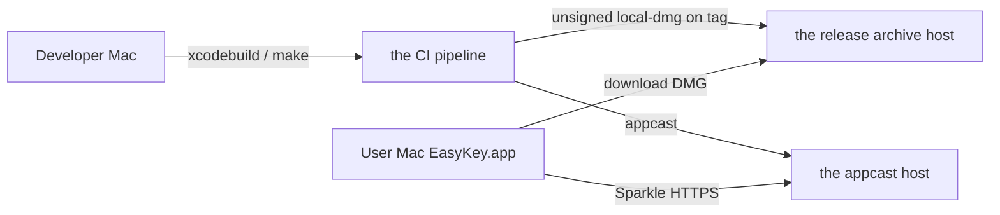
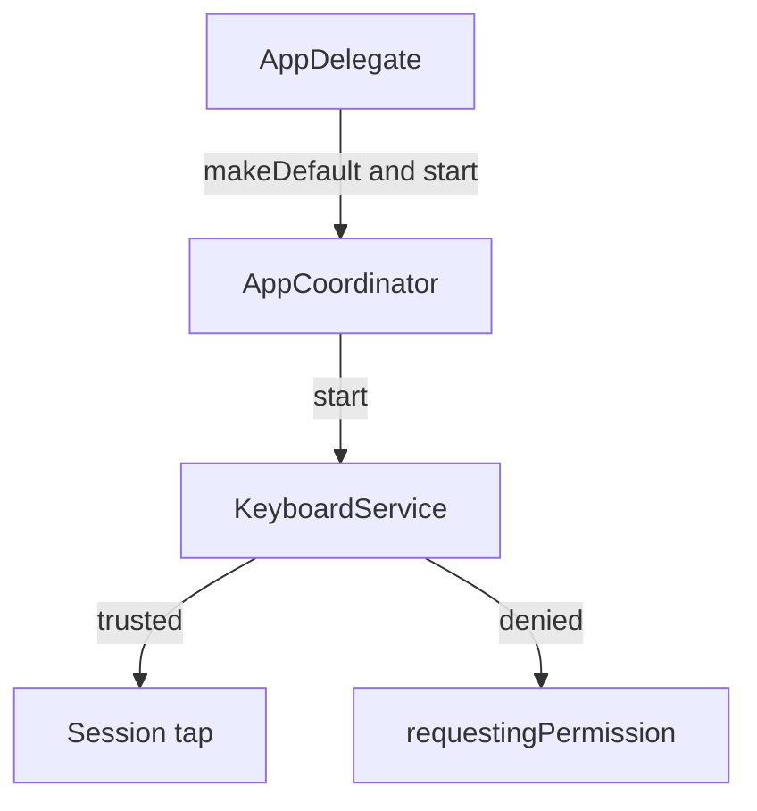

# Architecture

_Last reviewed: 2026-08-27_

**In one sentence:** EasyKey composes Vietnamese in other macOS apps through a session CGEvent tap, and optionally keeps clipboard history, macros, and translation (on-device Apple Translation or opt-in cloud HTTPS).

This file is the compact architecture section for maintainers and engineers who need the system's shape, hard bounds, and known shortcuts. It answers how EasyKey.app is built (App → Kit → Core plus a nested login helper) and where the event tap, clipboard/Keychain, translation trust, and Sparkle meet that structure. Product behavior lives in [product.md](product.md); step-by-step runtime lives in [flows.md](flows.md).

## At a glance

EasyKey.app is an accessory (menu-bar) process that owns UI, settings, clipboard, translation, Sparkle, and login-item registration. EasyKeyKit owns the CGEvent tap and keyboard pipeline. EasyEngineCore owns the Vietnamese engine and settings models and stays Foundation-only. EasyKeyLoginHelper.app is a sandboxed nested login item that only launches the host. Sparkle 2.9.4 checks an HTTPS appcast and downloads release DMGs.

Reading paths: start here for structure; [flows.md](flows.md) for launch, typing, clipboard panel, translation apply, and login registration; [security.md](security.md) for TCC, Keychain, and cloud disclosure; [engineering.md](engineering.md) for build and release; [operations.md](operations.md) for CI versus notarized DMG.

## Scope and boundaries

This file owns deployable blocks, permitted import direction, integration surfaces, whitebox wiring, constraints, direct dependencies, and tech debt. Adjacent sections own the rest: [product.md](product.md) (who it is for and what ships), [flows.md](flows.md) (ordered runtime), [engineering.md](engineering.md) (how to build and ship), [operations.md](operations.md) (CI, coverage, operator DMG), [security.md](security.md) (threats, data handling, permissions), [reference.md](reference.md) (settings and limits a user can observe), [concepts.md](concepts.md) (domain vocabulary when entries exist), [decisions.md](decisions.md) (ADRs when entries exist). The architecture folder has no unmerged sibling files in this compact layout.

## High-level architecture

EasyKey owns system-wide Vietnamese composition without an Input Method Kit IME. Architectural drivers: local-first typing with no analytics SDK; Accessibility plus a session event tap because the tap reads the user's keystroke stream; clipboard persistence and cloud translation off until the user opts in; Sparkle updates only over HTTPS with an EdDSA public key in the bundle.

**System in context.** The end user types in other apps and uses the menu bar. macOS TCC gates Accessibility. The Keychain holds clipboard and translation secrets as this-device generic passwords. Apple Translation.framework may run on-device on macOS 15+. Opt-in cloud providers receive source text over HTTPS URLSession only from translation surfaces after disclosure. Sparkle reads an HTTPS appcast; the enclosure is a DMG on the release archive host. The CI pipeline produces those artifacts.



**Containers.** EasyKey.xcodeproj produces EasyKey.app (LSUIElement accessory), EasyEngineCore.framework, EasyKeyKit.framework, EasyKeyLoginHelper.app nested under Contents/Library/LoginItems, Sparkle as an SPM product, EasyKeyTests hosted by EasyKey.app, and EasyKeyUITests.



**Relationship matrix**

| From | To | Verb | Channel | Owner |
|---|---|---|---|---|
| EasyKey.app | EasyEngineCore | embeds and imports | Xcode framework / Swift import | AppCoordinator and settings |
| EasyKey.app | EasyKeyKit | embeds and imports | Xcode framework / Swift import | KeyboardService from AppCoordinator |
| EasyKeyKit | EasyEngineCore | links | Xcode target / Swift import | KeyboardInputPipeline / VietnameseEngine |
| EasyKey.app | EasyKeyLoginHelper.app | embeds as login item | LoginItems + SMAppService | LoginItemController |
| EasyKey.app | Sparkle | links updater | SPM / SPUStandardUpdaterController | UpdateService |
| EasyKey.app | HTTPS appcast | checks for updates | HTTPS Sparkle feed + EdDSA | UpdateService when SUFeedURL and SUPublicEDKey resolve |
| EasyKey.app | macOS Keychain | stores secrets | Security SecItem | translation and clipboard key stores |
| EasyKey.app | Apple Translation | translates on-device when available | Translation.framework macOS 15+ | AppTranslationRuntime |
| EasyKey.app | Cloud translation | sends opt-in text | HTTPS URLSession ephemeral | AppTranslationRuntime |
| Sparkle | the release archive host DMG | downloads enclosure | HTTPS | Sparkle after appcast |
| EasyKeyTests | EasyKey.app | hosts tests | TEST_HOST | XCTest |

**Invariants:** App → Kit → Core import direction with EasyEngineCore Foundation-only. The event tap installs only when the process is Accessibility-trusted. At most one production EasyKey instance per user (UI-test launch excepted). Clipboard capture and cloud translation default off. Keychain items for translation and clipboard are this-device-only and do not use iCloud sync. Sparkle never instantiates a live updater in XCTest or `--uitesting`.

**Failure domains** (multi-process: host, helper, Sparkle, remote feeds): Accessibility/tap down degrades typing and selected-text capture; Clipboard persistence errors fail closed on load while RAM capture can continue; cloud translation errors stay in the panel; Sparkle absence skips background updates; login helper failure affects launch-at-login only.

**Deployment.** Execution spans a developer Mac, the CI pipeline (`macos-15` and tag `local-dmg`), the HTTPS appcast host, the release DMG host, and the end-user Mac (deployment target macOS 14). Omitted: container orchestration — this is a desktop app, not a multi-node service mesh.



Quality drivers with evidence: ArchitectureFitnessTests encode layering and no secrets in translation logs/settings; coverage goal 90% lines excluding the login helper; Apple Translation is unavailable on macOS 14. Forces that shaped the shape: session tap instead of IMK; unsandboxed host versus sandboxed helper. Decision records for those forces are not harvested in this run — see [decisions.md](decisions.md).

## Component design

This decomposition exists so a change in one layer cannot pull UI or Combine into Core, and so the tap, clipboard crypto, and translation providers stay behind App/Kit facades.

```text docforge-role=structure
EasyKey/
├── EasyKeyApp/           Host: AppDelegate, AppCoordinator, UI, clipboard, translation, Sparkle, login item
├── EasyKeyKit/           Keyboard event tap, input pipeline, paste synthesis
├── EasyEngineCore/       Vietnamese engine, settings models, Foundation-only
├── EasyKeyLoginHelper/   Nested login item: open host then exit
├── EasyKeyTests/         XCTest hosted by EasyKey.app
└── EasyKeyUITests/       UI tests; host runs as regular activation policy
```

The grouping matches the permitted import arrow: App may import Kit and Core; Kit may import Core; Core imports neither.

**Whiteboxes:** EasyKey.app composition root (why: start/stop and UI state); EasyKeyKit keyboard path (why: CGEvent and engine); EasyKey.app clipboard (why: AES-GCM + Keychain); EasyKey.app translation (why: Apple vs cloud trust). EasyKeyTests and EasyKeyUITests are not decomposed here — they host or drive the app. Sparkle remains a linked blackbox. the update hosts are external.

**AppDelegate** — **Responsibility:** finish launch, single-instance gate, accessory vs UI-test activation, terminate handshake · **Contract:** `NSApplicationDelegate` · **Talks to:** AppCoordinator — constructs via `makeDefault` and calls `start` / `stop` / `awaitShutdown` · **Invariant:** no coordinator when XCTest configuration is set · **Failure boundary:** extra production instance terminates; terminate waits for clipboard/settings flush.

**AppCoordinator** — **Responsibility:** composition root and collaborator lifecycle · **Contract:** `start()` / `stop()` / `awaitShutdown()` · **Talks to:** KeyboardService, ClipboardLifecycleManaging, AppTranslationRuntime, UpdateService, LoginItemController, StatusItemController, SettingsStore — starts and stops them · **Invariant:** serialized clipboard start/stop tasks · **Failure boundary:** Rapid start/stop must not leave clipboard running after cancel.

**KeyboardService** — **Responsibility:** tap install, health, pause, language toggle · **Contract:** `start()` / `stop()` / `Health` · **Talks to:** KeyboardEventTap and KeyboardInputPipeline — binds and drives · **Invariant:** desired state paused vs running · **Failure boundary:** Health `requestingPermission`, `degraded`, or `failed` without taking down the menu bar.

**KeyboardEventTap / KeyboardInputPipeline / VietnameseEngine** — **Responsibility:** session tap, compose Telex/VNI, post replacement events · **Contract:** Core engine `process` APIs; tap callback · **Talks to:** EasyEngineCore composers — Kit calls Core one way · **Invariant:** Core stays Foundation-only · **Failure boundary:** untrusted Accessibility never installs the tap.

**ClipboardServices / ClipboardHistoryModel / ClipboardPersistence** — **Responsibility:** monitor pasteboard, optional AES-GCM history · **Contract:** `ClipboardLifecycleManaging.start(loadPersisted:)` · **Talks to:** KeychainClipboardKeyStore — obtains AES key; Application Support `EasyKey/Clipboard` — sealed files · **Invariant:** fail-closed load when key or ciphertext is unusable · **Failure boundary:** persistence error does not stop RAM capture when capture is on.

**AppTranslationRuntime** — **Responsibility:** providers, disclosure, panel, hotkey · **Contract:** `start()` / `apply` path on TranslationModel · **Talks to:** KeychainTranslationCredentialStore and HTTPS providers or Apple Translation — resolves per settings · **Invariant:** production credentials not in settings JSON · **Failure boundary:** missing credentials or network stay in the panel.

**UpdateService** — **Responsibility:** Sparkle configure/start/check · **Contract:** `hasLiveUpdater` / `checkForUpdates()` · **Talks to:** SPUStandardUpdaterController — only when HTTPS feed and EdDSA key resolve and not testing · **Invariant:** no live updater in XCTest/`--uitesting` · **Failure boundary:** missing feed/key leaves updater nil.

**LoginItemController** — **Responsibility:** SMAppService register/unregister · **Contract:** `configure(enabled:)` · **Talks to:** `SMAppService.loginItem` for the helper identifier · **Invariant:** status maps to enabled/disabled/unsupported/failed · **Failure boundary:** register errors do not stop typing.

**Module wiring:** AppDelegate → AppCoordinator realizes host lifecycle. AppCoordinator → KeyboardService realizes Kit embedding. KeyboardService → VietnameseEngine realizes Kit→Core. AppCoordinator → ClipboardServices realizes persistence. AppCoordinator → AppTranslationRuntime realizes Apple/cloud. AppCoordinator → UpdateService realizes Sparkle. AppCoordinator → LoginItemController realizes helper embedding.

**Quality and change scenarios:** ArchitectureFitnessTests fail the build on Core importing AppKit/SwiftUI/Combine or Kit importing the app module. No throughput figure is evidenced.



Launch matters because every other collaborator hangs off `AppCoordinator.start`. Success: accessory app, status item, keyboard start, optional Sparkle start, clipboard task. Error path: untrusted Accessibility leaves typing off; extra instance terminates before `start`.

## Subsystem deep dives

No separate subsystem files are selected. Keyboard, clipboard, and translation stay folded here (compact budget). Standard-layout paths under `docs/architecture/subsystems/` are unmaterialized and are not linked.

**Keyboard event tap and Vietnamese engine** — **Parent block:** EasyKeyKit · **Responsibility:** session CGEvent tap and composition · **Non-responsibilities:** menu bar, Sparkle, clipboard files · **Boundary:** key events in; replacement events out; Accessibility required · **Invariant:** tap only when trusted · **Failure boundary:** sleep/wake and tap disable recover inside KeyboardService; remainder of the app stays up · Observability: `AppLog` keyboard category and `Health` · Lives in EasyKeyKit plus EasyEngineCore composers.

**Clipboard history and AES-GCM persistence** — **Parent block:** EasyKey.app · **Responsibility:** optional sealed history · **Non-responsibilities:** Keychain policy detail owned by [security.md](security.md) · **Boundary:** pasteboard events in; Application Support files out · **Invariant:** load fails closed · **Failure boundary:** `ClipboardPersistenceError` surfaces as persistence error on the model · Observability: clipboard logs without dumping payload bytes as a documented secret rule · Lives in EasyKeyApp Features/Clipboard.

**Translation Apple vs cloud trust** — **Parent block:** EasyKey.app · **Responsibility:** on-device vs opt-in HTTPS · **Non-responsibilities:** threat-model tables in [security.md](security.md) · **Boundary:** selected text or panel source in; translated text out · **Invariant:** cloud only after disclosure and credentials · **Failure boundary:** provider errors stay on the panel · Observability: translation logs must not include source, translation, or credentials (fitness tests) · Lives in EasyKeyApp Features/Translation.

## App lifecycle

macOS walks launch, accessory running, optional settings/clipboard/translation windows, then terminate. **Launch:** `applicationDidFinishLaunching` skips XCTest, enforces one instance, sets `.accessory` (or `.regular` for `--uitesting`), installs the Edit menu, `makeDefault`, `start`. **Running:** workspace observer, keyboard, translation, serialized clipboard start, optional settings at launch, Sparkle start when not UI-testing. **Background:** accessory apps do not use iOS-style background tasks; sleep/wake observers live on the keyboard tap. **Termination:** `applicationShouldTerminate` calls `stop`, returns `.terminateLater`, then `awaitShutdown` before reply. Kill mid-`stop` can skip the clipboard/settings flush — `awaitShutdown` exists so a cooperative quit waits. Restoration of UI windows after process death is not evidenced as state restoration API usage; settings and macros reload from files on next launch.

## UI state

| Surface | State owner | Survives transition | Process death | Error presentation |
|---|---|---|---|---|
| Menu bar / popover | StatusItemController + AppCoordinator published health | Popover dismisses when settings or clipboard panel opens | Recreated on launch | Keyboard health in menu/settings |
| Settings window | SettingsWindowPresenter + selectedSettingsSection | Section selection in coordinator | Lost; settings file remains | System health card |
| Clipboard panel | ClipboardPanelPresenter | Closed when menu popover will activate | Lost; history file if persistence on | persistenceError on model |
| Translation panel | TranslationPanelPresenter | Closed when menu popover will activate | Lost; no translation history in settings | Provider/credential errors on panel |
| Onboarding | AppLanguage onboardingCompletedKey in UserDefaults | Completes once | Persisted flag | Unknown beyond skip flags in UI tests |

Restoration after process death for in-memory pasteboard history when persistence is off is a loss — unmarked as tested beyond model persistence tests.

## Persistence

| Entity | Storage | Key | Why denormalized | Migration | Atomicity / crash | Recovery |
|---|---|---|---|---|---|---|
| App settings | JSON under Application Support `EasyKey` (Caches/temp fallback) | single file via SettingsRepository | one document | unknown versioning scheme beyond Codable defaults | `saveNow` on stop; in-flight debounce can lose last keystroke-sized edit if killed | fallback directories if Application Support missing |
| Macros | JSON file (UI-test temp or production URL) | MacroStore fileURL | document | unknown | unknown if killed mid-write | unknown |
| Smart Switch prefs | JSON | SmartSwitchStore | document | unknown | unknown | unknown |
| Clipboard history | AES-GCM `manifest.ekc` + payload files | Keychain AES key | payloads split to cap size | schemaVersion 1; unsupported schema errors | actor + atomic write helpers | fail-closed empty/error |
| Translation credentials | Keychain | KeychainTranslationCredentialStore | not in settings JSON | n/a | Keychain atomicity | missing key → cannot cloud-translate |
| Clipboard AES key | Keychain | KeychainClipboardKeyStore | not in JSON | n/a | Keychain | keyUnavailable → cannot persist |

Unverified crash-recovery for settings/macros JSON is marked unknown. Clipboard sealed writes use atomic file helpers and fail the save on malformed documents.

## Platform integration

**Accessibility / CGEvent session tap** — used for typing and selected-text capture · permission: Accessibility TCC (detail in [security.md](security.md)) · callback: tap callback on the keyboard queue · fallback: health requestingPermission, no tap.

**NSWorkspace / frontmost app** — Smart Switch and clipboard/translation previous-app reactivation · no extra TCC beyond what capture already needs · callback: workspace notifications · fallback: empty current application name.

**SMAppService login item** — launch at login · permission: user toggle · callback: none; register/unregister · fallback: unsupported/failed status.

**Sparkle** — updates · no TCC · callback: Sparkle UI · fallback: updater nil without HTTPS feed and EdDSA key.

**Translation.framework** — on-device translation when macOS 15+ · capability flag false on macOS 14 · fallback: Apple provider absent.

**Carbon/hotkeys** — clipboard and translation shortcuts · fallback: conflict flags or no registration.

**Pasteboard / synthesized Cmd+V** — clipboard paste-back · fallback: write errors; 120 ms paste delay in coordinator.

**Keychain (Security)** — secrets · this-device generic passwords · fallback: operations that need keys fail closed.

## AI integration

The model/provider boundary: Apple Translation stays in-process via Translation.framework when the OS supports it. Cloud calls leave the Mac only from EasyKey translation surfaces, over HTTPS, to the provider the user configured (DeepL, Google, OpenAI, Anthropic, Gemini, OpenRouter, Groq, or compatible endpoints listed in third-party notices). EasyKey does not bundle those SDKs.

Input contract: source text from the panel or selected-text capture after disclosure for cloud. Output: shown in the panel and optional speech; it does not drive the event tap. Failure: missing credentials, unsupported Apple OS, or network errors stay on the translation surface; keyboard and clipboard keep running. Privacy: cloud prompts send user source text to the chosen provider; whether a provider retains text is not evidenced in-repo (unknown). Apple's off-device behavior after language packs install is not evidenced here (research off) — the code treats Apple as the non-cloud path for disclosure.

## System overview

Major capabilities and owning flows: launch menu-bar app; start collaborators (clipboard lifecycle); compose Vietnamese; open clipboard history; apply translation runtime; register launch-at-login. Components per capability match the whiteboxes above; steps live in [flows.md](flows.md). Primary path: launch → coordinator start → tap (if trusted) → optional clipboard/translation. External systems: TCC, Keychain, Apple Translation, cloud HTTPS, Sparkle update hosts.

## Constraints

| Constraint | Limit | Source | Why it exists | What lifting it would take |
|---|---|---|---|---|
| Accessibility for the tap | No tap without `AXIsProcessTrusted` | macOS TCC / ApplicationServices | Session tap reads keystrokes | Different input architecture (e.g. IMK) plus App Store sandbox rules |
| Host not sandboxed | EasyKey.app unsandboxed; helper sandboxed | Login item + event tap design | CGEvent tap and AX as implemented | Redesign input; may be incompatible with current tap |
| macOS 14 deployment | Apple Translation off | `#available(macOS 15.0)` | Weak-link Translation | Raise deployment target |
| Sparkle needs HTTPS + EdDSA | No live updater if placeholders remain | UpdateService `hasReleaseConfiguration` | Unsigned feeds rejected | Supply real feed URL and public key at build |
| Single production instance | Second copy terminates | `isOnlyInstanceForCurrentUser` | Avoid duplicate taps | Change product rule |

**Non-goals (choices, not physics):** not an IMK input method; no analytics SDK; Core must not import AppKit; cloud translation is not on by default; clipboard persistence is not on by default.

## Dependencies

Risk-ordered direct runtime integrations. Licenses: Sparkle MIT-style permission notice in THIRD_PARTY_NOTICES; Apple frameworks APSL/OS; cloud providers are HTTPS APIs without bundled SDKs (no package license in-tree).

| Package / integration | Purpose | Criticality | If it disappeared |
|---|---|---|---|
| macOS Accessibility + CoreGraphics | Session tap and AX | High | Typing feature gone; app shell remains |
| EasyEngineCore (in-repo) | Composition engine | High | No Vietnamese output |
| EasyKeyKit (in-repo) | Tap pipeline | High | No system-wide typing |
| Sparkle 2.9.4 (SPM) | Signed updates | High for shipped updates | Manual download only; `canCheckForUpdates` false |
| Security Keychain | Clipboard and translation secrets | High for persist/cloud | Persistence and cloud fail closed |
| Translation.framework | On-device MT | Medium | Cloud or no Apple path |
| ServiceManagement | Login item | Medium | Launch-at-login unsupported |
| Cloud translation HTTPS | Opt-in MT | Medium | Panel errors; typing unaffected |
| Appcast + release DMG | Appcast and DMG | High for Sparkle | Updates stop until feed changes |

Build/tooling (Xcode, Swift 5, the CI pipeline, make) is summarized: CI cannot complete some AX/TranslationSession tests; notarized `make dmg` is operator-local. Failure handling is per integration above, not a lockfile dump.

## Technical debt

| Item | Shortcut taken | Cost it imposes | Remediation |
|---|---|---|---|
| Login helper Team ID sentinel | Release helper compares team to `TEAMID12345` | Signed helper with a real Team ID can terminate at launch | Replace sentinel with the shipping Team ID or drop the check |
| `system.checkForUpdates` unused by Sparkle | Toggle persists but UpdateService always starts the updater when configured | Users who switch the toggle off still get Sparkle start; button still checks | Wire automatic checks to the setting or remove the toggle |
| CI tag uses `make local-dmg` | Unsigned CI artifact vs local notarized `make dmg` | Testers may install a different trust path than production | Align workflows or document as the only supported channel |
| GitNexus labels many app symbols EasyKeyTests | Indexer module names follow TEST_HOST | Impact analysis mis-attributes ownership | Treat path as source of truth |

Fowler framing: Team ID and unused toggle are inadvertent/reckless relative to the intended product; CI unsigned DMG is deliberate/prudent for hosted runners that cannot notarize. User-visible “everything on your Mac” wording versus Sparkle/cloud is a documentation limitation owned by [product.md](product.md) and [security.md](security.md), not a code shortcut.
