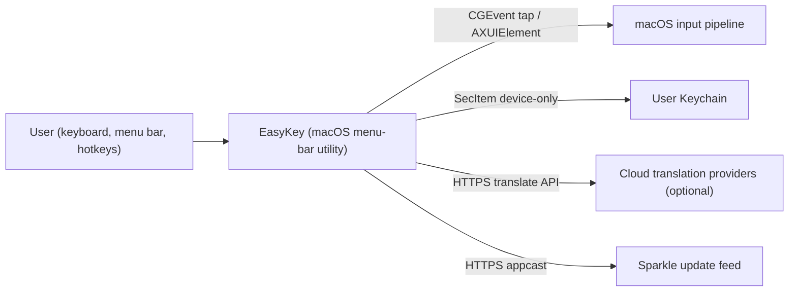

# Architecture

_Last reviewed: 2026-08-16_

EasyKey is a macOS menu-bar utility that converts keystrokes into Vietnamese text (Telex, Simple Telex, VNI), keeps a private clipboard history, and translates selected or typed text on-device or through opt-in cloud providers. This file is where engineers learn how the system is put together — its shape, its components, and the platform services it leans on. Newcomers start here to build a mental model of the codebase; engineers returning to plan a change use it to find the document that owns the detail they need.

## At a glance

EasyKey is built from five deployable pieces — three in-process Swift targets (`EasyKeyApp` for shell, UI, and coordination; `EasyKeyKit` for the keyboard event tap, input pipeline, and Accessibility text synthesis; `EasyEngineCore` for framework-free domain logic), an embedded login helper, and the bundled Sparkle updater framework. A system overview ties the major capabilities to the components and the primary end-to-end path ([system-overview](architecture/system-overview.md)); one facet document each covers lifecycle, platform integration, AI translation, UI state, and persistence. The high-level section below decomposes the shape.

## Scope and boundaries

This section owns *how the system is built*: structure, lifecycle, platform integration, AI integration, UI state, and persistence. It does not own the product story (what EasyKey does and who it is for — see [product](product.md)), the engineering workflow (setup, testing, release — see [engineering](engineering.md)), or the security posture (threats, data handling, permissions — see [security](security/README.md)). Facts that a facet document owns — a specific platform requirement or lifecycle detail — are stated in that document, never restated here.

| You want to | Read |
|---|---|
| Build the end-to-end mental model of the system first | [system-overview.md](architecture/system-overview.md) |
| Understand how typing and translation behave per OS service | [platform-integration.md](architecture/platform-integration.md) |
| Understand how the app's state is stored, written, and recovered | [persistence.md](architecture/persistence.md) |

## High-level architecture

EasyKey sits between the user and the macOS input pipeline. The user interacts through the menu-bar status item, popovers, a Settings window, and configurable hotkeys. The system consumes keyboard events system-wide via a `CGEvent` tap and reads focused text through the Accessibility API — the same trust boundary that gates the entire typing feature (composition output is applied as synthesized key events, not AX writes). It persists user data only to the local filesystem and the user's Keychain. It makes two optional outbound network calls: to a cloud translation provider (never for typing itself) and to an HTTPS Sparkle appcast for updates.

What crosses each boundary: keystrokes and focused-text edits in both directions with macOS (the event tap suppresses originals and the app posts synthesized edits); credentials and the clipboard history key into the Keychain (never synchronized); source text plus language pair to a cloud provider only when the user translates and a provider is configured; a signed DMG metadata feed from the Sparkle appcast. Typing itself crosses no network boundary.

Five deployable pieces make up the app — three in-process Swift targets, one embedded login item, and one framework the app bundles. Component-level mechanism and per-feature detail live in the facet documents, not here.

| Block | Responsibility | Technology | External interface | Boundary it owns |
|---|---|---|---|---|
| EasyKeyApp | Runs the menu-bar presence, Settings scene, clipboard manager, translation runtime, and all coordination wiring | SwiftUI + AppKit | `NSStatusItem`, `NSPopover`, Settings window, Carbon hotkeys, `NSWorkspace` notifications | Orchestration and user-facing state |
| EasyKeyKit | Owns system input plumbing: event tap, input pipeline, key synthesis, focused-text replacement, per-app compatibility | CoreGraphics, ApplicationServices, Foundation | `CGEvent` tap, `AXUIElement` | Everything that touches the keyboard/AX boundary |
| EasyEngineCore | Framework-free domain: Vietnamese engine (Telex/VNI), settings model, macros, Smart Switch, converter, clipboard policy, translation contracts | Pure Swift (Foundation only) | None (in-process calls) | Typing rules, settings schema, persistence formats |
| EasyKeyLoginHelper | Launches the host app at login if it is not already running | AppKit, ServiceManagement | SMAppService login item | Host-launch guarantee and integrity checks |
| Sparkle (bundled) | Delivers signed updates from an HTTPS appcast | Sparkle 2.9.4 (SPM) | `SPUStandardUpdaterController` | Update lifecycle and EdDSA verification |

**Boundaries and invariants:**

- **Typing is local, always.** Keyboard transformation and preferences are processed on the Mac; general keyboard input is never translated or uploaded.
- **The main app is not sandboxed.** `com.apple.security.app-sandbox` is `false` for EasyKeyApp — required for the session-wide event tap, the Sparkle updater, and the login helper contract. The login helper itself runs sandboxed.
- **Clipboard capture is off by default** (`isCaptureEnabled = false`), and persistence is opt-in: history stays in memory unless the user enables it, in which case it is AES-GCM sealed with a device-only Keychain key.
- **Single instance.** A second launch detects the running instance and terminates itself.
- **Cloud translation is opt-in per provider.** Source text leaves the device only from explicit translation surfaces when a provider is configured; credentials live in the Keychain and are never synchronized.
- **No telemetry.** The app ships no analytics; logging is local and redacted.

This document changes once or twice a year: blocks are named at the level of targets and responsibilities, not classes. A claim that a routine refactor would falsify is written too close to the code; input-plumbing and event-mask detail lives in [platform-integration.md](architecture/platform-integration.md), and known platform limits (for example the Spotlight workaround) live in [reference](reference.md), not here. The invariants that encode the architecture choices — the event-tap approach instead of Input Method Kit, single-instance enforcement, the encrypted clipboard, the sandbox stance — are stated above. Externally imposed bounds (macOS 14 target, Accessibility requirement) are documented in the root README and [reference](reference.md).

## Related sections

- [Product](product.md) — what EasyKey does and who it is for.
- [Engineering](engineering.md) — setup, testing, conventions, and release for working on this architecture.
- [Reference](reference.md) — configuration, compatibility, and limitation facts the design depends on.
- [Security](security/README.md) — the threat model, data handling, and permissions that constrain the design.
