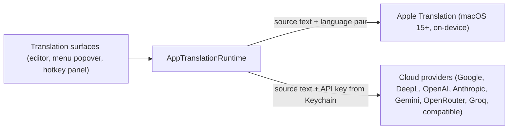

# AI integration

_Last reviewed: 2026-08-13_

EasyKey has no trained or fine-tuned model of its own — model-quality claims are therefore out of scope. This document covers the integration boundary only: what reaches a model, through which provider, and what happens to the result. Translation runs either on-device (Apple Translation, macOS 15+) or through a user-configured cloud provider; the runtime resolves the active provider from platform capability and configured credentials. Typing itself never touches a model.

The boundary is deliberately narrow: exactly one request type (translate), a fixed set of provider adapters behind the `TranslationProviding` protocol, and no EasyKey-operated server in the path.

## Prompt/input surface

What reaches the model: plain source text plus a source/target language pair (`TranslationRequest`) — there are no prompt templates, system prompts, or conversational context. Input enters through three surfaces: the translation editor (user-typed), the menu-bar popover translation field, and captured selected text (`SelectedTextCaptureCoordinator`).

Scoping before a request reaches the network:

- **Selection capture is capped.** `AccessibilitySelectedTextReader` reads the focused element's selected text only for supported roles (text field, text area, combo box, static text, web area) and refuses secure fields; oversized selections (`> TranslationRequest.maximumSourceTextLength`) and blank results are rejected before any request.
- **Fallback capture restores the pasteboard.** When AX reading fails, `SystemSelectedTextSimulator` posts a simulated Cmd+C, saves and restores the user's pasteboard items, and only then submits.
- **Endpoints are fixed or validated.** Built-in providers use compile-time-validated URLs (`_validatedURL`); user-supplied "compatible" endpoints are rejected by `HostSafety` unless they resolve to public, non-private, non-loopback hosts.
- **Auto-translate is time-boxed.** Every user edit invalidates the pending request and reschedules the debounced auto-translate (`setSourceTextFromUserInput` → `scheduleAutoTranslate`), so partial typing does not send a stream of half-formed requests.

## Output handling

**Used as:** shown directly to the user (advisory, user-confirmed) — never used to drive an action.

The provider response lands in the translation model and is rendered in the translation panel or menu-popover view; the user decides to replace the source text in the editor (via `TranslationTextEditor`), copy the result, or invoke optional speech. There is no path where model output triggers a system action, a write, or further network traffic.

## Safety and evaluation

**Safety controls:** no content filtering is applied to either direction — source text is sent verbatim and completions are shown verbatim. The controls that do exist are structural: first-use disclosure identifies each cloud provider before its first request (`TranslationDisclosureController`); credentials are validated against the provider's own endpoints before first use (`TranslationSettingsModel` probes provider model endpoints via `LiveTranslationCredentialValidator`); user-supplied endpoints are host-validated; and the Apple provider is availability-gated per OS.

**Evaluation evidence:** each provider adapter has a dedicated unit suite (`AppleTranslationProviderTests`, `GoogleTranslationProviderTests`, `DeepLTranslationProviderTests`, `OpenAICompatibleTranslationProviderTests`, credential-validation suites under `EasyKeyTests/`), and selected-text capture has its own suite (`SelectedTextCaptureTests`). Translation output quality is not evaluated by this repository — for cloud models that evaluation belongs to each provider; for Apple Translation it is Apple's model lifecycle, not EasyKey's.

## Failure and fallback

- **Provider unavailable:** adapters map network/HTTP failures to `TranslationError.providerUnavailable` (20 s request timeout); the panel presents the error and keeps the source text — no silent retry, no queue.
- **Unsupported language pair:** surfaces as `unsupportedLanguagePair`; the Apple provider additionally maps Apple's own unsupported-pair errors through the same domain error.
- **Language pack missing (Apple):** `appleLanguageDownloadRequired` tells the user a download is needed rather than failing opaque.
- **Cancellation:** user dismissal cancels the in-flight request and maps to `.cancelled`; in-flight state is dropped, not corrupted.
- **Credential failure:** stored-key absence or rejection shows `missing`/`invalid` status in the translation settings; translation requests from panels fail closed with the same status.

## Privacy boundary

- **Does user data leave the system in the prompt?** Yes, but only under explicit conditions: a cloud provider must be selected and configured, and a request is sent only from a translation surface (editor, popover, or hotkey panel) when the user translates or the configured auto-translate delay elapses after an edit. Typing and clipboard content never reach a provider.
- **Is it retained by the provider?** EasyKey does not know — providers handle submitted text under their own terms (documented per-provider in [data-handling.md](../security/data-handling.md)). EasyKey itself does not proxy or log source text, results, or history, and writes nothing to disk; an in-memory session (source text + result) is held until app restart under the default `sessionPersistence = .keepUntilRestart` policy and cleared on surface close only under `.clearOnClose` ([data-handling.md](../security/data-handling.md)).
- **Credentials:** API keys live in the user's Keychain, device-only and non-synchronizing (`KeychainTranslationCredentialStore`); validation is a live endpoint check that does not submit source text.

See [data-handling](../security/data-handling.md) for the data-flow classification and [threat-model](../security/threat-model.md) for the model/provider call as an external trust boundary.

Model-quality or safety claims for a self-trained model would belong to a model lifecycle document, not here — this repository trains no model.
