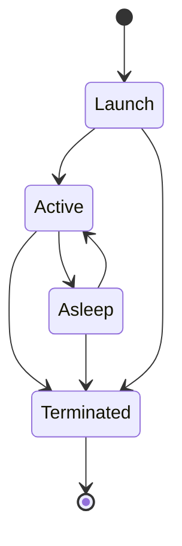

# Application lifecycle

_Last reviewed: 2026-08-13_

EasyKey is a menu-bar accessory (`LSUIElement`, activation policy `.accessory` unless UI testing) with no document windows and no iOS-style backgrounding. Its lifecycle is therefore: launch, active (menu-bar presence with the event tap installed), system sleep as the only true suspension, and termination. Single-instance enforcement is part of launch: `AppCoordinator.isOnlyInstanceForCurrentUser()` terminates a second instance before it registers anything.

## Launch

**Owner:** `AppDelegate.applicationDidFinishLaunching` + `AppCoordinator.start()`.

**Trigger:** user launch, Finder open, or the login item (`EasyKeyLoginHelper`) launching the host.

**Must do before leaving:** run the single-instance check (skipped under `--uitesting`); set activation policy (`.accessory`, or `.regular` under `--uitesting` so the settings window can receive clicks on headless CI); install the system Edit menu (`AppMainMenuInstaller`) because accessory apps lack one — without it Cmd+V never reaches text fields; then `AppCoordinator.start()`, which binds and installs the status item, observes settings and localization changes, starts the workspace observer, starts the update service (skipped under `--uitesting`), seeds the active-application context, starts the keyboard service, starts translation, chains the clipboard start task (awaiting any previous start/stop task first), and shows the Settings window at launch when `settings.system.showSettingsAtLaunch` is enabled.

**Restoration on relaunch:** `SettingsStore` (wrapping `SettingsRepository`) loads `settings.json` from `~/Library/Application Support/EasyKey/` — decoding supported schema versions and migrating older ones — `MacroStore` loads `macros.json`, `SmartSwitchStore` loads `smart-switch.json`, and the clipboard model loads persisted history only when `clipboard.persistsHistory` is enabled. The onboarding gate (`hasCompletedOnboarding`) restores from `UserDefaults`.

**On kill mid-transition:** before `start()` completes nothing is registered and nothing persists — a kill here is a clean no-op. The only risk window is a kill during the debounced settings write (`SettingsStore`, 300 ms debounce).

## Active

**Owner:** `AppCoordinator` (state) with `KeyboardService` (event tap health).

**Trigger:** launch completes; also every system wake and every return from sleep state.

**Must do before leaving:** when the tap is installed and Accessibility is trusted, `KeyboardService` keeps health at `.active` (`startIfPermitted`); on application activation it updates the active-app context (deferring the switch while the pipeline is composing) and refreshes Accessibility permission; on `activeSpaceDidChange` it resets the composition session; on wake it resets the session, refreshes the input source, and re-checks permission. Each tap event is recorded with its disposition (passed/suppressed/bypassed/self-posted/disabled) and latency — no key content. The clipboard monitor polls while capture is enabled.

**Restoration on relaunch:** in-memory only — the composition session, popovers, and published state (`selectedSettingsSection` resets to `.typing`) are not restored across process death; persisted state comes back from the stores named under Launch.

**On kill mid-transition:** `KeyboardService` holds no persistent state, so a kill is clean; in-memory clipboard history is lost unless persistence is enabled (then it is AES-GCM sealed on the debounced save path, losing at most the newest entries).

## Asleep

**Owner:** `KeyboardService` via its sleep/wake observer (tap teardown) + `WorkspaceObserver` (session-reset routing).

**Trigger:** `NSWorkspace.willSleepNotification` — observed independently by both `KeyboardSleepWakeObserver` (installed by `KeyboardService.start()` through `KeyboardEventTap`) and `WorkspaceObserver`.

**Must do before leaving:** `KeyboardService.handleSystemSleep()` tears down the tap's `CFMachPort` and run-loop source and drops health to `.degraded` (or `.stopped` when paused); the workspace observer resets the composition session. The status item, clipboard monitor, and updater keep running as normal.

**Restoration on relaunch (wake):** `didWakeNotification` reaches both observers: `KeyboardSleepWakeObserver` routes to `handleSystemWake()`, which refreshes the input source and re-installs the tap when Accessibility is trusted; `WorkspaceObserver` routes to `AppCoordinator.configureWorkspaceObserver`'s wake handler, which resets the keyboard session, refreshes the input source and Accessibility permission, and calls `clipboard.handleWake()` to refresh the monitor's observed change count. The pipeline's per-app context is re-derived from the frontmost application on the next activation event.

**On kill mid-transition:** nothing is mid-write during sleep; the tap is already torn down, so a kill while asleep is equivalent to a kill in Active minus the tap.

## Terminated

**Owner:** `AppDelegate.applicationShouldTerminate` + `AppCoordinator.stop()`/`awaitShutdown()`.

**Trigger:** user Quit, `NSApp.terminate(nil)` (status-item Quit), or the second-instance self-termination.

**Must do before leaving:** `applicationShouldTerminate` calls `coordinator.stop()` and returns `.terminateLater`; `stop()` cancels the settings and localization observers, stops the workspace observer, tears down the status item and popover, stops keyboard service and translation, closes the settings window, cancels the clipboard start task, then awaits the clipboard stop — which flushes any pending persisted-history write (`flushPendingSave`) — and `settingsStore.saveNow()`. Only when `awaitShutdown()` completes does the app reply `true` to the terminate request.

**Restoration on relaunch:** same as Launch — file stores are reloaded; the persisted clipboard document's sealed payloads decrypt with the device-only Keychain key.

**On kill mid-transition:** a hard kill (force-quit, crash) skips the stop choreography: the debounced settings write (300 ms) may be lost, and any pending clipboard persistence flush is lost; the sealed document on disk is only ever replaced atomically, so it stays readable (or absent) rather than corrupt. Failure boundaries for each subsystem's flush are covered by the [architecture overview](README.md#scope-and-boundaries).
