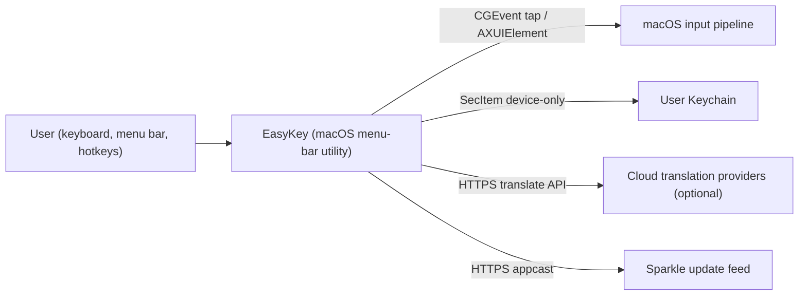

# High-level architecture

_Last reviewed: 2026-08-03_

EasyKey is a macOS menu-bar utility that turns raw keystrokes into Vietnamese text (Telex, Simple Telex, and VNI rule sets), keeps a private clipboard history, and translates selected or typed text through on-device or cloud providers. It owns the "type Vietnamese in any application, with per-application preferences, without a telemetry trail" capability: transformation runs entirely on the Mac, the app behaves as a menu-bar accessory (`LSUIElement`), and it is distributed as a universal DMG with Sparkle updates.

## System in context

_C4 context view: this system as one box among the actors and services around it — name the neighbors and the contracts between them, never the internals._

EasyKey sits between the user and the macOS input pipeline. The user interacts through the menu-bar status item, popovers, a Settings window, and configurable hotkeys. The system consumes keyboard events system-wide via a `CGEvent` tap and reads/writes focused text through the Accessibility API — the same trust boundary that gates the entire typing feature. It persists user data only to the local filesystem and the user's Keychain. It makes two optional outbound network calls: to a cloud translation provider (never for typing itself) and to an HTTPS Sparkle appcast for updates.

What crosses each boundary: keystrokes and focused-text edits in both directions with macOS (the event tap suppresses originals and the app posts synthesized edits); credentials and the clipboard history key into the Keychain (never synchronized); source text plus language pair to a cloud provider only when the user translates and a provider is configured; a signed DMG metadata feed from the Sparkle appcast. Typing itself crosses no network boundary.

## Containers and blackboxes

_C4 container view: the deployable pieces inside that one box — never mix this zoom level with the context diagram above._

Five deployable pieces make up the app: three in-process Swift targets, one embedded login item, and one framework the app bundles. Component-level mechanism lives in [low-level.md](low-level.md); deep subsystem write-ups live under [concepts/](concepts/README.md).

_One row per block that matters for orientation. Technology cites [tech-stack.md](../reference/tech-stack.md)._

| Block | Responsibility | Technology | External interface | Boundary it owns |
|---|---|---|---|---|
| EasyKeyApp | Runs the menu-bar presence, Settings scene, clipboard manager, translation runtime, and all coordination wiring | SwiftUI + AppKit | `NSStatusItem`, `NSPopover`, Settings window, Carbon hotkeys, `NSWorkspace` notifications | Orchestration and user-facing state |
| EasyKeyKit | Owns system input plumbing: event tap, input pipeline, key synthesis, focused-text replacement, per-app compatibility | CoreGraphics, ApplicationServices, Foundation | `CGEvent` tap, `AXUIElement` | Everything that touches the keyboard/AX boundary |
| EasyEngineCore | Framework-free domain: Vietnamese engine (Telex/VNI), settings model, macros, Smart Switch, converter, clipboard policy, translation contracts | Pure Swift (Foundation only) | None (in-process calls) | Typing rules, settings schema, persistence formats |
| EasyKeyLoginHelper | Launches the host app at login if it is not already running | AppKit, ServiceManagement | SMAppService login item | Host-launch guarantee and integrity checks |
| Sparkle (bundled) | Delivers signed updates from an HTTPS appcast | Sparkle 2.9.4 (SPM) | `SPUStandardUpdaterController` | Update lifecycle and EdDSA verification |

## Relationship matrix

_One row per material edge between blocks, or between a block and an external actor — directional, one specific active verb._

| Origin | Destination | Action | Protocol / channel |
|---|---|---|---|
| User | EasyKeyApp | triggers (left-click, hotkeys, menu items) | `NSStatusItem` events, Carbon hotkeys, `NSPopover` clicks |
| EasyKeyApp | EasyKeyKit | starts/stops, pushes settings and macros | direct in-process calls (`KeyboardService`) |
| EasyKeyKit | EasyEngineCore | feeds `KeyEvent`s, reads `EngineConfiguration` | direct in-process calls (`VietnameseEngine`) |
| EasyKeyKit | macOS | installs event tap, reads/replaces focused text | `CGEvent` + `AXUIElement` |
| EasyKeyApp | Keychain | stores/loads credentials and history key | `SecItem` (device-only, non-sync) |
| EasyKeyApp | Cloud providers | sends translation requests | HTTPS JSON via `URLSession` |
| EasyKeyApp | Sparkle appcast | polls for updates | HTTPS RSS via `SPUStandardUpdaterController` |

## Boundaries and invariants

- **Typing is local, always.** Keyboard transformation and preferences are processed on the Mac; general keyboard input is never translated or uploaded ([README.md](../README.md)).
- **The main app is not sandboxed.** `com.apple.security.app-sandbox` is `false` for EasyKeyApp — required for the session-wide event tap, the Sparkle updater, and the login helper contract. The login helper itself runs sandboxed.
- **Clipboard capture is off by default** (`isCaptureEnabled = false`), and persistence is opt-in: history stays in memory unless the user enables it, in which case it is AES-GCM sealed with a device-only Keychain key.
- **Single instance.** A second launch detects the running instance and terminates itself.
- **Cloud translation is opt-in per provider.** Source text leaves the device only from explicit translation surfaces when a provider is configured; credentials live in the Keychain and are never synchronized.
- **No telemetry.** The app ships no analytics; logging is local and redacted ([log-redaction](decisions/log-redaction.md)).

## Stable by design

This document changes once or twice a year: blocks are named at the level of targets and responsibilities, not classes. A claim here that a routine refactor would falsify — e.g. exactly which component posts a synthesized key — is written too close to the code and belongs in [low-level.md](low-level.md). Per-app compatibility rules, spotlight workarounds, and event-mask details live there and in [PROBLEMS.md](../reference/limitations.md), not here.

## Why it is like this

Rationale for the architecture choices — the event-tap approach instead of Input Method Kit, single-instance enforcement, the encrypted clipboard, settings deltas, Sparkle updates — lives in the [decision log](decisions/README.md). Known shortcuts are tracked in [tech-debt.md](tech-debt.md). Hard, externally imposed bounds (macOS 14 target, Accessibility requirement, sandbox constraint) live in [constraints.md](constraints.md).
