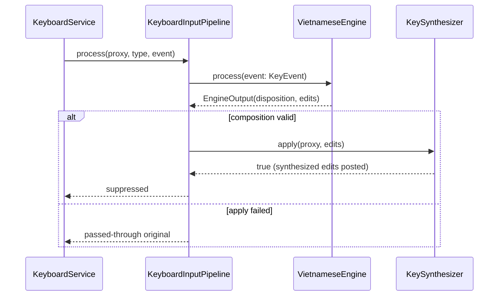

# Low-level architecture

_Last reviewed: 2026-08-13_

Component-level decomposition. Zooms into the five blocks named in [high-level.md](high-level.md). It never becomes a Level-4 code or class document.

## Layout

```text docforge-role=structure
EasyKey/
├── EasyKeyApp/           App shell: status item, Settings scene, clipboard, translation, coordination
├── EasyKeyKit/           Keyboard event tap, input pipeline, key synthesis
├── EasyEngineCore/       Framework-free domain: engine, settings, macros, smart switch, converter
├── EasyKeyLoginHelper/   Embedded SMAppService login item that launches the host
├── EasyKeyTests/         Unit + integration tests (one suite per feature area)
├── EasyKeyUITests/       XCUITest suites for settings, onboarding, navigation, accessibility
├── Scripts/              QA gate, archive/export, DMG, appcast generation
└── Makefile              Build, test, coverage-gate, lint, release entry points
```

The grouping reveals the runtime boundary: everything that touches the system keyboard/Accessibility boundary lives in EasyKeyKit, everything that encodes product rules lives in framework-free EasyEngineCore, and EasyKeyApp is pure orchestration plus UI — so unit tests can exercise domain logic with no app or system coupling.

## Selected whiteboxes

_Repeat per high-level block worth a component-level decomposition._

### EasyKeyApp

**Motivation for decomposition:** the app shell is the coordination hub — 26+ call sites reference `AppCoordinator` — and its responsibilities (status item, settings window, clipboard, translation, login item, updater) are distinct enough that a review of "who owns which state" needs named components, not one class tour.

**Allowed dependency direction:** EasyKeyApp → EasyKeyKit → EasyEngineCore, always inward. No component in a lower layer may depend on a higher one; EasyEngineCore imports nothing but Foundation.

### EasyKeyKit

**Motivation for decomposition:** the keyboard boundary has three very different risk profiles — event capture (must not loop), transformation (must be exact), and output (must not corrupt the focused element). Splitting capture, pipeline, and synthesis lets each be tested and tuned independently.

**Allowed dependency direction:** EasyKeyKit → EasyEngineCore only; the kit never references app-layer state.

### EasyEngineCore

**Motivation for decomposition:** the Vietnamese engine, settings model, and stores are the most heavily tested code (engine edge-case and tone-placement suites, store async-save suites) and must stay framework-free so tests run without app bootstrap.

**Allowed dependency direction:** none outward; EasyEngineCore is the bottom of the stack.

## Components

_Repeat per component inside these whiteboxes — the ones material to the decomposition's motivation above, not an exhaustive file listing._

### AppCoordinator

**Responsibility:** wires every subsystem together: owns `@Published` runtime state (keyboard health, paused flag, current app, selected settings section, revisions), observes settings and applies `SettingsDelta`-gated updates, and owns start/stop/`awaitShutdown` sequencing.

**Technology:** Swift, Combine (`@MainActor` `ObservableObject`).

**Public contract:** `AppCoordinator.makeDefault()`, `start()`, `stop()`, `awaitShutdown()`, `showSettings(section:)`, `setLanguage/setInputMethod/setEncoding`.

- **Talks to:** -> KeyboardService — starts/stops, pushes settings/macros, reads health; -> StatusItemController — installs status item, updates menu snapshot; -> SmartSwitchController — forwards app activations; -> ClipboardServices — applies options, starts/stops capture; -> AppTranslationRuntime — applies translation settings.
- **Owns:** the single settings observer, the clipboard start/stop task chain, and the published state every surface renders from.
- **Invariant:** all coordinator code runs on the main actor; a task chain guarantees clipboard `start`/`stop` never overlap (previous task is awaited before the next starts).
- **Failure boundary:** `stop()` cancels observers and tasks but waits for the clipboard flush and `settingsStore.saveNow()` before `awaitShutdown` returns; a hard kill skips the flush and loses at most the debounced settings write.
- **Key paths:** `EasyKeyApp/Coordination/AppCoordinator.swift`, `EasyKeyApp/Coordination/AppCoordinatorWiring.swift`

### KeyboardService

**Responsibility:** public facade for the event tap, pipeline, and diagnostics; owns the health state machine and the serialized `processingQueue`.

**Technology:** CoreGraphics, ApplicationServices; `DispatchQueue` serialization.

**Public contract:** `start()`, `stop()`, `refreshPermission()`, `requestAccessibilityPermission()`, `update(settings:)`, `update(macros:)`, `setActiveApplication(_:)`, `resetSession()`, `togglePause()`; `Health` = `stopped|requestingPermission|active|degraded|failed`.

- **Talks to:** -> KeyboardEventTap — installs/tears down the tap and workspace sleep/wake observers; -> KeyboardInputPipeline — forwards every tapped event; -> KeyboardDiagnosticsRecorder — records disposition and latency per event.
- **Owns:** the event-tap lifecycle and the health/pause published state consumed by `HealthPill` and the status item.
- **Invariant:** events posted by KeySynthesizer's own marker (`selfPostedEventMarker`) are passed through untouched — the service never re-processes its own output.
- **Failure boundary:** a `tapDisabledByTimeout`/`tapDisabledByUserInput` event tears the tap down, sets health to `degraded`, and re-requests permission; pipeline failures never crash the app (failures degrade to pass-through).
- **Key paths:** `EasyKeyKit/Keyboard/KeyboardService.swift`, `EasyKeyKit/Keyboard/KeyboardEventTap.swift`

### KeyboardInputPipeline

**Responsibility:** turns each raw event into either a suppressed edit or a pass-through: shortcut matching (language switch, restore-word), macro expansion, per-application compatibility rules, Spotlight/Chromium-address-bar detection, and engine invocation.

**Technology:** CoreGraphics event normalization; `AppCompatibilityRule` workarounds from `EasyKeyKit/Keyboard/Context/AppCompatibility.swift`.

**Public contract:** `process(proxy:type:event:keyCode:) -> KeyboardProcessResult`, `update(settings:)`, `update(macros:)`, `setActiveApplication(_:)`, `resetSession()`.

- **Talks to:** -> VietnameseEngine — mutates composition state; -> KeySynthesizer — applies produced edits.
- **Owns:** composition session, active app context, address-bar/Spotlight detection caches.
- **Invariant:** while composing, an application switch is deferred rather than applied mid-word; a non-idempotent edit is never retried.
- **Failure boundary:** when `apply(proxy:output:)` fails, the pipeline resets the session and passes the original event through — the user sees raw typing instead of corruption.
- **Key paths:** `EasyKeyKit/Keyboard/KeyboardInputPipeline.swift`

### KeySynthesizer

**Responsibility:** applies engine edits to the focused application by synthesizing physical key events — backspace bursts plus typed text — with per-app replacement strategies (atomic focused text, selection replacement, break-autocomplete, physical backspace). It never writes through the accessibility API.

**Technology:** CoreGraphics (`CGEvent`) only; no `AXUIElement` writes exist anywhere in the edit path.

**Public contract:** `postBackspace(proxy:count:) -> Bool`, `postUnicodeText(proxy:_:) -> Bool`, `postPhysicalKey(proxy:keyCode:modifiers:) -> Bool`, `postShiftLeft(proxy:count:) -> Bool`; static `markAsSelfPosted(_:)`, `isSelfPosted(_:)`. (Edit application itself is `KeyboardInputPipeline`'s private `apply(proxy:_:)`.)

- **Talks to:** -> the event-tap proxy — posts synthesized `CGEvent`s back into the stream. (Read-only `FocusedElementInspector` AX reads belong to the pipeline's Chromium address-bar detection, not to synthesis.)
- **Owns:** the replacement-strategy decision (atomic focused text, selection replacement, break-autocomplete, physical backspace) and the self-posted-event marker that prevents feedback loops.
- **Invariant:** synthesized events are always tagged with the self-posted marker before posting.
- **Failure boundary:** a synthesis step that fails returns false and the pipeline passes the original event through; a non-idempotent edit is never retried.
- **Key paths:** `EasyKeyKit/Keyboard/Synthesis/KeySynthesizer.swift`, `EasyKeyKit/Keyboard/FocusedElementInspector.swift`

### VietnameseEngine

**Responsibility:** streaming Vietnamese composition — raw keystrokes are the source of truth; every edit recomputes the composed buffer through `TelexComposer` so backspace, repeat-to-undo, and per-word raw restore are exact.

**Technology:** pure Swift, no OS imports.

**Public contract:** `process(event: KeyEvent) -> EngineOutput`, `reset()`, `resetComposition()`, `restoreRawKeys() -> EngineOutput`, `currentBuffer`.

- **Talks to:** (none outward — leaf of the typing path).
- **Owns:** `SessionState` (rawKeys, atoms, tone, forceRaw), sentence-start capitalization, VNI tone validity, spell-check/auto-restore of invalid words.
- **Invariant:** invalid VNI tone digits are dropped without being appended to `rawKeys`; composition never emits an edit without a preceding replace-backward of the rendered count.
- **Failure boundary:** the engine is a value type with no I/O; every event path either emits edits (`disposition .suppress`) or returns `.pass` — there is no partial state to corrupt.
- **Key paths:** `EasyEngineCore/Engine/VietnameseEngine.swift`, `EasyEngineCore/Engine/VietnameseCharacters.swift`

### SettingsRepository

**Responsibility:** loads, migrates, and atomically persists `EasyKeySettings` as JSON; enforces the 1 MB import ceiling and schema-version checks.

**Technology:** Foundation, `JSONEncoder`/`JSONDecoder`, atomic file writes on a serial queue.

**Public contract:** `update(_ transform:)`, `reset()`, `export(to:)`, `import(from:) -> ImportDiagnostics`, `load()`, `saveNow()`.

- **Talks to:** -> SettingsStore (app layer) — pushes new `settings` through `onSettingsChange`; the store publishes them into SwiftUI.
- **Owns:** the settings file at `~/Library/Application Support/EasyKey/settings.json` and the migration chain.
- **Invariant:** writes are debounced 300 ms and atomic; a write is never issued concurrently with another (serialized `writeQueue`).
- **Failure boundary:** a corrupt or unsupported-schema file falls back to `.defaults`; import errors throw typed `SettingsRepositoryError` values the UI can present.
- **Key paths:** `EasyEngineCore/Settings/SettingsRepository.swift`, `EasyKeyApp/Settings/SettingsStore.swift`

### SmartSwitchStore

**Responsibility:** per-application language/encoding preferences persisted as JSON, keyed by a stable application identity (bundle id, else path, else name).

**Technology:** pure Swift, atomic JSON writes.

**Public contract:** `handleAppFocus(_:currentChoice:now:) throws -> SmartSwitchFocusResult`, `reset(key:)`, `clearAll()`, `preferences`.

- **Talks to:** -> SmartSwitchController — decides apply/record/ignore on activation and applies remembered choices back through the settings store.
- **Owns:** the preference document (schema version 1) at `smart-switch.json` next to the settings file.
- **Invariant:** while a remembered choice is being applied, `isApplyingSmartSwitch` blocks re-recording the same choice (no feedback loop).
- **Failure boundary:** store errors surface as `.unavailable` status text in the Smart Switch settings section; the keyboard keeps its current state.
- **Key paths:** `EasyEngineCore/SmartSwitch/SmartSwitchStore.swift`, `EasyKeyApp/Coordination/SmartSwitchController.swift`

### ClipboardPersistence

**Responsibility:** serializes every clipboard persistence operation; AES-GCM-seals history and stores image/RTF payloads in separate sealed files.

**Technology:** CryptoKit, Security, an actor for serialization; `ClipboardKeyStore` supplies the 256-bit Keychain-backed key.

**Public contract:** `save(entries:payloads:) throws`, `load() throws -> ClipboardPersistedState` (actor-isolated).

- **Talks to:** -> ClipboardHistoryModel — debounced save/flush lifecycle; -> KeychainClipboardKeyStore — existing/create/delete key.
- **Owns:** the persisted-history document format (schema version 1) and its key.
- **Invariant:** history is never persisted in plaintext when persistence is enabled; the key is device-only and never synchronized.
- **Failure boundary:** decryption failure, missing key, or malformed document raise typed `ClipboardPersistenceError` values; the UI surfaces them and keeps an empty in-memory history rather than crashing.
- **Key paths:** `EasyKeyApp/Features/Clipboard/ClipboardPersistence.swift`, `EasyKeyApp/Features/Clipboard/ClipboardKeyStore.swift`

### AppTranslationRuntime

**Responsibility:** owns the translation feature: provider registry, disclosure flow, hotkey activation, selected-text capture, speech, and the settings model.

**Technology:** Swift concurrency; `NSLock`-guarded `TranslationProviderRegistry`; Keychain credential store.

**Public contract:** `start()`, `stop()`, `apply(settings:)`, `applyActivationSettings(_:)`, `makePopoverConfiguration(...)`, `settingsModel`.

- **Talks to:** -> provider adapters (Apple/Google/DeepL/OpenAI/Anthropic/Gemini/OpenRouter/Groq/compatible) through `TranslationProviding`; -> SelectedTextCaptureCoordinator; -> TranslationCredentialStore.
- **Owns:** which providers are available, credential status, the disclosure-before-first-use gate.
- **Invariant:** Apple's provider is only ever constructed inside a macOS 15 runtime-availability guard; all mutable registry state is lock-guarded.
- **Failure boundary:** provider errors map to typed `TranslationError` values (unavailable, unsupported pair, language download required, cancelled); the panel shows the error and the editor keeps the source text.
- **Key paths:** `EasyKeyApp/Features/Translation/AppTranslationRuntime.swift`, `EasyKeyApp/Features/Translation/TranslationCredentialStore.swift`

## Runtime scenario

One architecturally relevant intra-block path is traced below; every message maps to a named component above.

### KeyDown to composed text

This scenario is why the architecture exists: one keystroke must be intercepted, transformed, and re-emitted without the user seeing the raw syllable.



Outcome on the success path: the original keyDown is suppressed and the focused element shows the composed syllable, delivered as synthesized physical key events (backspace bursts plus typed text) with the per-app replacement strategy. On the failure path the original event passes through untouched, so the user always sees at worst the raw typing, never a duplicated or corrupted edit.

## Data model

The main entities, described — not a schema dump; a routine column rename must not falsify this.

- `EasyKeySettings` (schema-versioned) groups `input` (language, input method, encoding), `typing` (spell check, tone style, shortcuts), `macro`, `compatibility` (per-app rules and ignore lists), `smartSwitch`, `system` (dock icon, launch at login, menu-bar width), `converter`, `clipboard`, and `translation` options — see [configuration](../reference/configuration.md).
- `EngineConfiguration` is derived from `EasyKeySettings` per pipeline update, with compatibility workarounds overlaid (e.g. `.unicodeCombiningOutput` for Safari).
- `SessionState` holds the raw keystroke buffer, composed atoms/tone, and the `forceRaw` freeze flag.
- `Macro` (trigger, expansion, enabled, timestamps) persists to `macros.json`; expansions are pre-encoded per active encoding.
- `SmartSwitchPreference` (stable key, display name, language+encoding choice, last-used date) persists to `smart-switch.json`.
- `ClipboardEntry` + sealed binary `payloads` persist as one versioned document per save.
- `TranslationRequest` (source text, language pair) and `TranslationResponse` (translated text, detected source) are the wire contracts all providers implement.

## Significant subsystems

The ones worth a full deep-dive get their own folder under [concepts/](concepts/README.md):

| Subsystem | Deep-dive |
|---|---|
| _(none authored yet)_ | Deep-dives land at `concepts/<slug>/README.md` as they are written |

## Cross-cutting concerns

| Concern | Where it lives | Notes |
|---|---|---|
| Configuration | `EasyEngineCore/Settings/SettingsRepository.swift` + `EasyKeyApp/Settings/SettingsStore.swift` | See [configuration](../reference/configuration.md) |
| Error handling | Typed errors (`SettingsRepositoryError`, `MacroStoreError`, `ClipboardPersistenceError`, `TranslationError`) surfaced per surface | No fatal errors on user input paths |
| Logging | `EasyEngineCore/Diagnostics/AppLog.swift` (os.Logger, privacy-tagged) | See [log-redaction](decisions/log-redaction.md) |
| Authentication | `KeychainTranslationCredentialStore` + `KeychainClipboardKeyStore` | Device-only, non-synchronizing |
| Persistence | `SettingsRepository`, `MacroStore`, `SmartSwitchStore`, `ClipboardPersistence` | Atomic JSON; clipboard AES-GCM |
