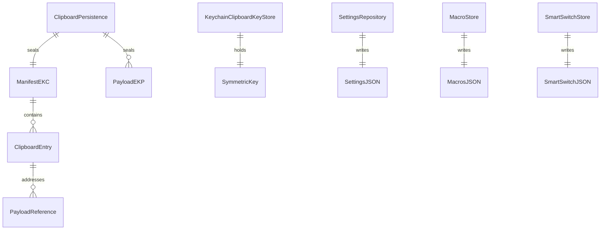

# Persistence

_Last reviewed: 2026-08-16_

EasyKey persists five kinds of state. Clipboard history is encrypted at rest; settings, macros, and smart-switch preferences are plain JSON documents written atomically; translation credentials live only in the Keychain and never touch the filesystem. The [clipboard history flow](../flows/clipboard-history.md) owns the runtime behavior; this document owns the durability mechanics beneath it.

## Clipboard history

**Storage:** `<Application Support>/Clipboard/manifest.ekc` + `<Application Support>/Clipboard/payloads/*.ekp` · **Key:** AES-GCM 256-bit symmetric key in the Keychain (service `one.ifelse.easykey.clipboard`, account `history-key`)

**Denormalization:** binary image/RTF payloads are stored in separate sealed files (`payloads/<sanitized-reference>.ekp`) and referenced from the manifest by an opaque reference string — Core keeps only the reference, never the bytes. Manifest entries reference payloads; orphan payload files are removed on every save. No other denormalization.

`ClipboardPersistence` (an actor — every operation is serialized) seals a versioned JSON document (`manifest.ekc`, schema version 1 with `savedAt` and `entries`) plus one sealed file per payload reference using the Keychain-derived key (`EasyKeyApp/Features/Clipboard/ClipboardPersistence.swift`). The key is `kSecAttrAccessibleWhenUnlockedThisDeviceOnly` and never synchronized, so persisted history cannot leave the device (`EasyKeyApp/Features/Clipboard/ClipboardKeyStore.swift`). Enforced safety limits (`EasyKeyApp/Features/Clipboard/PasteboardSnapshot.swift`): a single event may not exceed 10 MB, retained payloads may not exceed 100 MB total, and the sealed manifest is bounded by the same per-event cap plus 64 bytes of AES-GCM overhead.

## Settings

**Storage:** `~/Library/Application Support/EasyKey/settings.json` (falls back to Caches, then temp) · **Key:** none (plain JSON)

**Denormalization:** none — one document per settings schema.

`SettingsRepository` loads on init (migrating if needed), updates are serialized through `@MainActor`, and every write is atomic and debounced (300 ms) via a detached utility task (`EasyEngineCore/Settings/SettingsRepository.swift`). Writes go through a dedicated serial queue; export/import are atomic too, with imports capped at 1 MB and rejected when the schema version is newer than supported.

## Macros

**Storage:** `~/Library/Application Support/EasyKey/macros.json` (test seams pass an explicit file URL) · **Key:** `Macro.id` (UUID)

**Denormalization:** none. `MacroStore` persists the full macro array as a pretty-printed JSON document, writing the encoded candidate to disk first, then committing to memory — a failed write leaves in-memory state unchanged (`EasyEngineCore/Macros/MacroStore.swift`). Each macro keeps its `trigger`/`expansion`/`enabled`/`category` plus `createdAt`/`updatedAt`; trigger limits (128 chars) and expansion limits (16 KB) are enforced before any write.

## Smart-switch preferences

**Storage:** `~/Library/Application Support/EasyKey/smart-switch.json` · **Key:** per-application stable key (bundle identifier or path)

**Denormalization:** none. `SmartSwitchStore` writes a versioned document (schema version 1) with the same save-candidate-then-commit pattern as macros, debounced 100 ms (`EasyEngineCore/SmartSwitch/SmartSwitchStore.swift`). A preference records the per-app typing choice and `lastUsedAt`; a schema-version mismatch on load falls back to an empty store.

## Translation credentials

**Storage:** Keychain only (service `one.ifelse.easykey.translation`) · **Key:** per-provider API credential

**Denormalization:** none. Provider API keys are stored via `KeychainTranslationCredentialStore` as Keychain generic passwords and never written to the filesystem (`EasyKeyApp/Features/Translation/TranslationCredentialStore.swift`). Credential storage is opt-in per provider; the security posture around stored credentials is covered by the [security section](../security/README.md).

## Migrations

**Mechanism:** in-code version-bump loop · **Versioning:** integer `schemaVersion` per document · **Reversible:** no

- **Settings:** `SettingsMigration.migrate` reads `schemaVersion` from the JSON, walks it forward one step per version to `EasyKeySettings.currentSchemaVersion` (currently 11), and rewrites the document; the per-version step is currently a passthrough reserved for future field migrations (`EasyEngineCore/Settings/SettingsMigration.swift`). Imports of a newer schema version are rejected rather than downgraded.
- **Clipboard history:** schema version 1 today; a newer `schemaVersion` on load raises `unsupportedSchema` instead of attempting an in-place migration.
- **Smart switch:** schema version 1; any mismatch on load resets to an empty store.
- **Macros:** no versioned schema; an undecodable file loads as an empty macro list.

## Transaction and consistency boundary

Clipboard persistence is the only multi-entity store, and its units are atomic: a save validates the whole candidate (entry shape, referenced payloads present, byte caps), writes every new payload file, then writes the manifest atomically; only after the manifest lands are orphan payloads removed. A crash at any point leaves the previous manifest intact with possibly extra payload files, which the next save cleans up. Reads verify the manifest schema, decrypt, and re-check entry validity before any payload byte is trusted (`EasyKeyApp/Features/Clipboard/ClipboardPersistence.swift`).

Settings, macros, and smart switch are single-document stores with no cross-document consistency requirement: each write is atomic in itself, and there is no multi-entity consistency model (read-your-writes holds per store via its in-memory state, applied only after a successful write).

## Failure recovery

- **Clipboard history:** atomic manifest writes mean a crash during save keeps the last good manifest; a crash mid-payload-write leaves an orphaned payload file that is pruned on the next save. `deleteAll` removes the directory and the Keychain key together, so "clear history" is all-or-nothing. Key loss surfaces as `keyUnavailable` on load, which the model reports as a persistence error rather than silently recreating data (`EasyKeyApp/Features/Clipboard/ClipboardPersistence.swift`, `EasyKeyApp/Features/Clipboard/ClipboardKeyStore.swift`).
- **Settings:** atomic writes on a serial queue mean a crash keeps the previous document; an unreadable file falls back to defaults with a log line. A write in flight during a crash is lost at most once (the 300 ms debounce window).
- **Macros:** atomic write to the candidate file first — a crash either keeps the old file or lands the complete new one; in-memory state is only replaced after the disk write succeeds.
- **Smart switch:** same candidate-then-atomic-write pattern with a 100 ms debounce; in-flight writes are cancelled and flushed on stop.
- **Payload size guards:** every read is bounded (`boundedData` checks the regular-file flag, size caps, and decrypted byte counts), so a corrupted or hostile file cannot force unbounded memory allocation.
