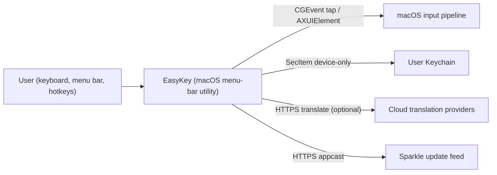
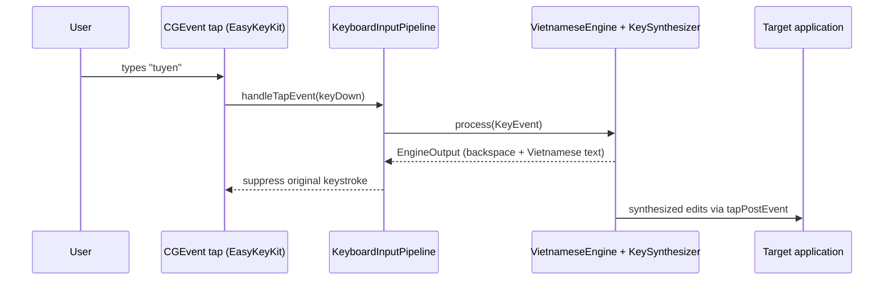

# System overview

_Last reviewed: 2026-08-13_

EasyKey is a macOS menu-bar utility with three main-priority capabilities: Vietnamese keyboard typing transformation (Telex/Simple Telex/VNI) that runs entirely on the machine through a session-wide CGEvent tap; a private clipboard history manager whose capture is memory-only by default with opt-in encrypted persistence; and translation through Apple's on-device framework (macOS 15+) or user-configured cloud providers. Typing and clipboard content never cross a network boundary; the only outbound calls are translation requests from explicit translation surfaces and the Sparkle update check. Component detail per capability lives in [high-level.md](high-level.md) and [low-level.md](low-level.md); this page routes to the flows.

## Primary end-to-end path

The journey a newcomer should trace first is a keystroke becoming Vietnamese text: it crosses the most capabilities — the event tap, the pipeline's shortcut/compatibility gates, the Telex/VNI engine, synthesis back into the target application — and it is the only path every other feature orbits. Trace it in [keyboard-typing.md](../flows/keyboard-typing.md).

## Feature → owning flow → subsystem

_One row per major capability — enough for a newcomer to find their way, not the
full feature list. Rows marked "indexed, deferred" are evidenced in the flow
index but have no deep-dive flow document yet._

| Capability | Owning flow | Implementing subsystem |
|---|---|---|
| Vietnamese keyboard typing (Telex/Simple Telex/VNI) | [keyboard-typing](../flows/keyboard-typing.md) | EasyKeyKit (event tap, pipeline, synthesis) + EasyEngineCore (`VietnameseEngine`) |
| Clipboard history capture, persistence, restore | [clipboard-history](../flows/clipboard-history.md) | EasyKeyApp (`ClipboardMonitor`, `ClipboardHistoryModel`) |
| Translation via on-device or cloud providers | [translation](../flows/translation.md) | EasyKeyApp (`AppTranslationRuntime`) |
| Per-application language Smart Switch | [indexed, deferred](../flows/README.md) | EasyKeyApp (`SmartSwitchController`) + EasyEngineCore |
| Macro expansion from triggers | [indexed, deferred](../flows/README.md) | EasyKeyKit (`KeyboardMacroExpander`) + EasyEngineCore |
| Launch-at-login registration and watchdog | [indexed, deferred](../flows/README.md) | EasyKeyApp (`LoginItemController`) + `EasyKeyLoginHelper` |
| Sparkle app updates | [indexed, deferred](../flows/README.md) | EasyKeyApp (`UpdateService`) |

Link out to [`docs/flows/README.md`](../flows/README.md) for the full matrix;
do not duplicate its rows.
