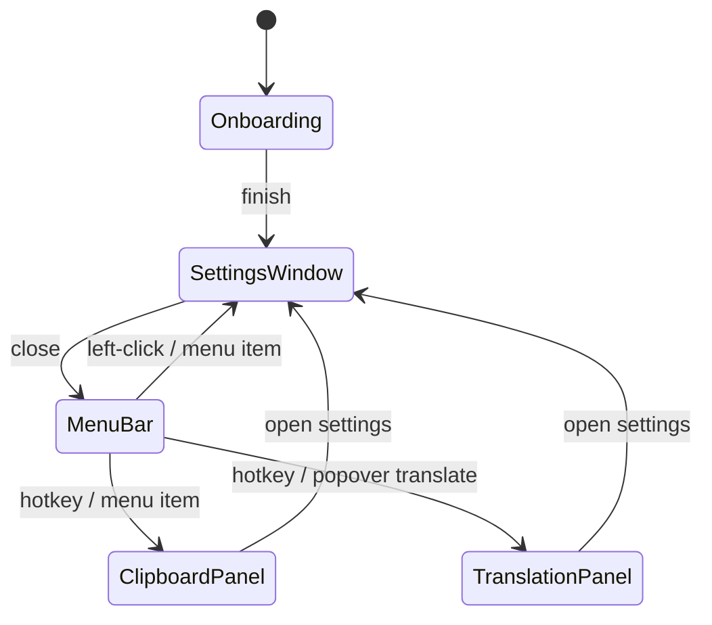

# UI navigation and state

_Last reviewed: 2026-08-15_

EasyKey has five surfaces — the menu-bar status item with popover, the Settings window, the clipboard panel, the translation panel, and the onboarding flow (which renders inside the settings window's content area). There is no `NavigationStack`-style hierarchy; navigation is a small set of intentional transitions between these surfaces, all owned by `AppCoordinator`-published state, and the transient popovers are torn down before the Settings window is presented (the close-then-present ordering is handled by dispatching to the next run-loop pass to avoid an AppKit popover race).

## Menu bar status item and popover

**State owner:** `StatusItemController` (the `NSStatusItem`/`NSPopover` pair) with `AppCoordinator` published state feeding the menu snapshot.

**Allowed transitions:** left-click toggles the popover (`togglePopover`, which also refreshes Accessibility permission); the status menu routes to `showSettings(section:)`, the clipboard panel, the translation popover, restart keyboard service, convert clipboard, show logs, about, and quit; the popover can host the translation mini-surface and an "open settings" action.

**Survives transition:** popover content is rebuilt on demand from the coordinator's snapshot (`menuSnapshotProvider` reads live settings — language, input method, encoding, current app, Smart Switch status, pause state), so an open popover reflects changes; opening Settings from the popover closes the popover first. The status-item icon is rendered from the `menuBarIconStyle`, `menuBarIconScale`, and `grayMenuIcon` settings, re-rendered when the effective appearance changes (`observeStatusItemAppearance`); paused or unhealthy states replace it with a tinted system symbol (orange pause, red warning) (`StatusItemController.swift:276-324, 366-387, 434-465`). While the popover is shown it arms local and global click monitors and dismisses only when `PopoverOutsideClickDecision.shouldClose` judges the click outside the popover, the status button, and every EasyKey window — a click on the Settings window or the clipboard panel no longer closes it (`StatusItemController.swift:180-226`).

**Restoration on process death:** none — the popover does not exist across launches; the status item is reinstalled at launch with state rebuilt from settings.

**Error presentation:** keyboard health renders as the popover status symbol/title (`MenuPopoverView` state symbol and color) and in the status-menu title (`menuBarStateTitle`); pause state renders in both; the `HealthPill` appears on the onboarding Accessibility step; permission-request state routes "open settings" to the System section (`showSettingsFromPopover`).

## Settings window

**State owner:** `SettingsWindowPresenter` (window lifecycle) + `AppCoordinator.selectedSettingsSection` (`@Published`, default `.typing`).

**Allowed transitions:** entered from any surface via `showSettings(section:)`; sidebar selection switches the detail pane among the nine sections (typing, encoding, smartSwitch, translation, clipboard, macros, behavior, system, about); the sidebar toggle hides/shows the sidebar (`--ui-sidebar-hidden` preset for UI tests); closing returns to the menu bar.

**Survives transition:** the selected section survives window close/reopen within the process (coordinator-owned); the detail view is tagged `.id(selectedSettingsSection)` so switching sections resets per-section local state; `systemHealthNavigationRevision` forces a refresh of the System card when permission state changed.

**Restoration on process death:** the section resets to `.typing`; settings values themselves restore from `settings.json` on relaunch.

**Error presentation:** per-section status rows (Smart Switch current-app status, clipboard hotkey conflict, translation credential states, keyboard health card); permission-required navigation jumps to System.

## Clipboard panel

**State owner:** `ClipboardHistoryModel` (entries, selection, pins, in-memory history) with `ClipboardPanelPresenter` owning the transient `NSPopover`.

**Allowed transitions:** opened by hotkey (default `⌥V`) or the status menu; panel actions route to `showSettings(section: .clipboard)`, close, or reveal files in Finder; the panel closes before any paste action's cancel-pending-paste completes.

**Survives transition:** selection action and pinned state are model-owned and persist while the app runs; history persistence is a separate opt-in (`persistsHistory`) that survives process death via the AES-GCM sealed document.

**Restoration on process death:** loads persisted history only when enabled; otherwise an empty history.

**Error presentation:** hotkey conflict (`hasConflict`, old shortcut kept registered on failure), pasteboard-read failures, and persistence errors (`keyUnavailable`, `decryptionFailed`) surface as status/alert text.

## Translation panel

**State owner:** `AppTranslationRuntime` — `TranslationModel` for the active request/result, `TranslationDisclosureController` for the first-use gate, `TranslationHotKeyController` (Carbon registrar) for activation.

**Allowed transitions:** opened by hotkey (default `⌥C`), from the menu popover translate action, or from settings; panel actions open the translation settings section, dismiss, or replace the editor text with the result.

**Survives transition:** credential status and provider selection are persisted settings; an in-flight request is cancelled on panel dismissal (maps to `.cancelled`, no corrupted state).

**Restoration on process death:** none for the panel itself; provider configuration restores from settings and the Keychain.

**Error presentation:** per-provider credential states (`missing`/`saved`/`validating`/`ready`/`invalid`) in settings; provider/language errors shown in the panel with the source text preserved.

## Onboarding

**State owner:** `OnboardingView` local `@State step` (0–3: Welcome, Accessibility, Typing method, Ready) plus `@AppStorage("hasCompletedOnboarding")` as the gate.

**Allowed transitions:** shown instead of `SettingsShell` inside the ContentView when onboarding is incomplete; Back/Continue move between steps; Finish sets the flag and swaps to the Settings shell; the Accessibility step requests permission and reflects `keyboardHealth` live.

**Survives transition:** the completion flag is sticky (UserDefaults) — onboarding is never re-shown after Finish; UI-test arguments can preset the flag (`--ui-skip-onboarding`) and the language.

**Restoration on process death:** the flag restores from UserDefaults, so a user who finished onboarding is not re-onboarded after a crash.

**Error presentation:** the Accessibility step shows the health pill and a Grant button when the process is not trusted.
