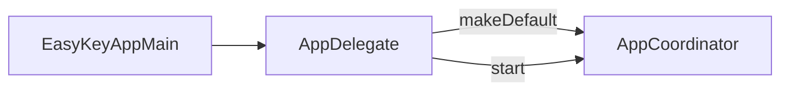
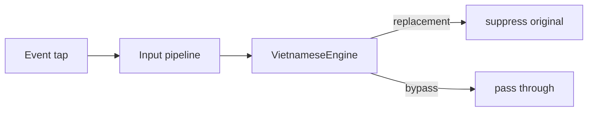
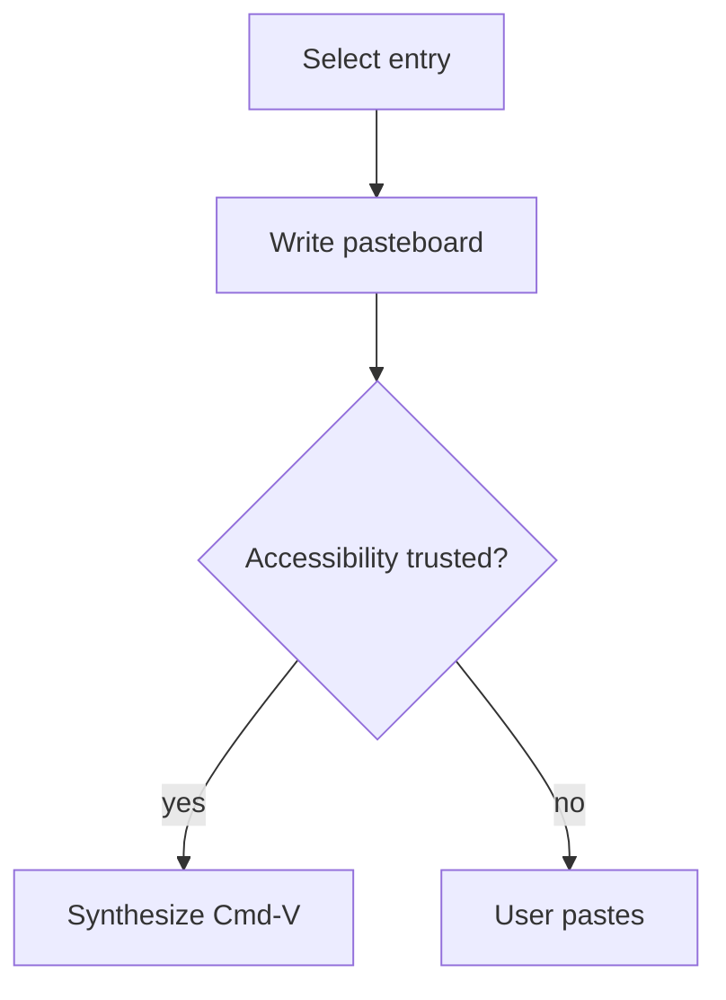
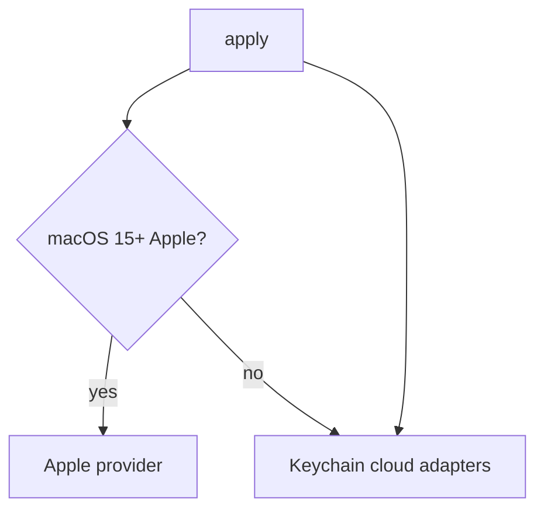
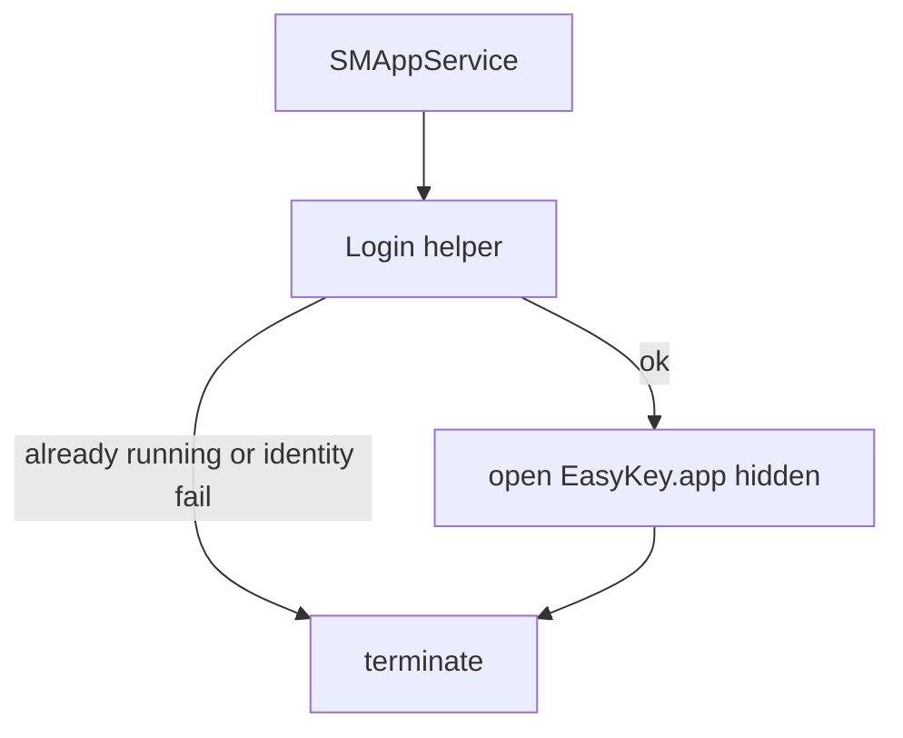

# Flows

_Last reviewed: 2026-08-27_

EasyKey's runtime work is launch, collaborator start, Vietnamese composition, clipboard panel, translation apply, and launch-at-login. Start with launch, then composition. Structure lives in [architecture.md](architecture.md); outcomes in [product.md](product.md).

## At a glance

Six flows are written below. Every other GitNexus candidate stays in the matrix as coverage, not as a deep dive. GitNexus interchange has no ordered STEP_IN_PROCESS list; steps come from analysis cards plus source.

## Flow candidate matrix

| Flow | Entry | Area | Confidence | Reach (steps) | Priority | Status |
|---|---|---|---|---|---|---|
| [Launch the menu-bar app](#launch-menu-bar-app) | `Function:EasyKeyApp/AppDelegate.swift:AppDelegate.applicationDidFinishLaunching#1` | comm_162, comm_58, comm_60, comm_61, comm_75,… | candidate | 6 | main | documented |
| [Start app collaborators](#start-app-collaborators) | `Method:EasyKeyApp/Coordination/AppCoordinator.swift:ClipboardLifecycleManaging.start#1` | comm_60, comm_7, comm_75, comm_83, comm_86, c… | candidate | 6 | main | documented |
| [Compose a Vietnamese character](#compose-vietnamese-character) | `Function:EasyEngineCore/Engine/VietnameseEngine.swift:VietnameseEngine.processCharacter#2` | comm_11, comm_20, comm_23, comm_25, comm_28 | candidate | 5 | main | documented |
| [Open clipboard history](#open-clipboard-history) | `Function:EasyKeyApp/Coordination/AppCoordinator.swift:AppCoordinator.showClipboardPanel#0` | comm_100, comm_101, comm_63, comm_75 | candidate | 10 | main | documented |
| [Apply translation runtime settings](#apply-translation-runtime) | `Function:EasyKeyApp/Features/Translation/AppTranslationRuntime.swift:AppTranslationRuntime.apply#1` | comm_144, comm_146, comm_150, comm_200, comm_… | candidate | 4 | main | documented |
| [Register launch-at-login](#register-launch-at-login) | `Function:EasyKeyApp/Coordination/LoginItemController.swift:LoginItemController.configure#1` | comm_7, comm_76 | candidate | 3 | main | documented |
| AppCoordinator.configureStatusItemController#0 | `Function:EasyKeyApp/Coordination/AppCoordinatorWiring.swift:AppCoordinator.configureStatusItemController#0` | comm_245, comm_253, comm_60, comm_64, comm_66… | candidate | 7 | main | matrix only |
| TranslationSettingsAccessibility.providerRow#1 | `Function:EasyKeyApp/Features/Settings/Translation/TranslationSettingsView.swift:TranslationSettingsAccessibility.providerRow#1` | comm_142, comm_152, comm_153, comm_217, comm_… | candidate | 8 | main | matrix only |
| TranslationProviderSettings.providerBody#1 | `Function:EasyKeyApp/Features/Settings/Translation/TranslationSettingsView.swift:TranslationProviderSettings.providerBody#1` | comm_131, comm_136, comm_142, comm_145, comm_… | candidate | 5 | main | matrix only |
| ClipboardPanelView.row#1 | `Function:EasyKeyApp/Features/Clipboard/ClipboardPanelView.swift:ClipboardPanelView.row#1` | comm_105, comm_106, comm_195, comm_75, comm_95 | candidate | 7 | main | matrix only |
| ClipboardLifecycleManaging.stop#0 | `Method:EasyKeyApp/Coordination/AppCoordinator.swift:ClipboardLifecycleManaging.stop#0` | comm_245, comm_252, comm_60, comm_7, comm_83 | candidate | 5 | main | matrix only |
| StatusItemController.statusItemClicked#1 | `Function:EasyKeyApp/Coordination/StatusItemController.swift:StatusItemController.statusItemClicked#1` | comm_75, comm_86, comm_88 | candidate | 6 | main | matrix only |
| KeyboardInputPipeline.processFlagsChanged#3 | `Function:EasyKeyKit/Keyboard/KeyboardInputPipeline.swift:KeyboardInputPipeline.processFlagsChanged#3` | comm_107, comm_20, comm_35, comm_7, comm_8, c… | candidate | 6 | main | matrix only |
| KeyboardInputPipeline.processMacro#3 | `Function:EasyKeyKit/Keyboard/KeyboardInputPipeline.swift:KeyboardInputPipeline.processMacro#3` | comm_107, comm_20, comm_235, comm_257, comm_4… | candidate | 5 | main | matrix only |
| VietnameseEngine.processBackspace#0 | `Function:EasyEngineCore/Engine/VietnameseEngine.swift:VietnameseEngine.processBackspace#0` | comm_11, comm_19, comm_20, comm_24, comm_25, … | candidate | 7 | main | matrix only |
| BehaviorSettingsView.applicationRegistry#4 | `Function:EasyKeyApp/Features/Settings/Behavior/BehaviorSettingsView.swift:BehaviorSettingsView.applicationRegistry#4` | comm_116, comm_45, comm_67, comm_7 | candidate | 9 | main | matrix only |
| MacroSettingsView.addSamples#1 | `Function:EasyKeyApp/Features/Settings/Macros/MacroSettingsView.swift:MacroSettingsView.addSamples#1` | comm_10, comm_38, comm_39, comm_71 | candidate | 5 | main | matrix only |
| StatusItemController.startOutsideClickMonitoring#0 | `Function:EasyKeyApp/Coordination/StatusItemController.swift:StatusItemController.startOutsideClickMonitoring#0` | comm_84, comm_85 | candidate | 4 | main | matrix only |
| Recover typing after sleep | `Function:EasyKeyKit/Keyboard/KeyboardService.swift:KeyboardService.handleSystemWake#0` | comm_107, comm_20, comm_245, comm_250, comm_2… | candidate | 7 | main | matrix only |
| AppCoordinator.restartKeyboardService#0 | `Function:EasyKeyApp/Coordination/AppCoordinator.swift:AppCoordinator.restartKeyboardService#0` | comm_245, comm_246, comm_251, comm_252, comm_… | candidate | 5 | main | matrix only |
| TranslationDisclosureController.presentPrompt#2 | `Function:EasyKeyApp/Features/Translation/TranslationDisclosureController.swift:TranslationDisclosureController.presentPrompt#2` | comm_195, comm_75 | candidate | 4 | main | matrix only |
| TranslationHotKeyController.apply#1 | `Function:EasyKeyApp/Features/Translation/TranslationHotKeyController.swift:TranslationHotKeyController.apply#1` | comm_144, comm_196 | candidate | 3 | main | matrix only |
| ClipboardServices.configurePanelContent#0 | `Function:EasyKeyApp/Features/Clipboard/ClipboardServices.swift:ClipboardServices.configurePanelContent#0` | comm_103, comm_61, comm_93 | candidate | 6 | main | matrix only |
| ClipboardServices.stop#0 | `Function:EasyKeyApp/Features/Clipboard/ClipboardServices.swift:ClipboardServices.stop#0` | comm_101, comm_94, comm_97 | candidate | 4 | main | matrix only |
| KeyboardInputPipeline.update#1~EasyKeySettings | `Function:EasyKeyKit/Keyboard/KeyboardInputPipeline.swift:KeyboardInputPipeline.update#1~EasyKeySettings` | comm_107, comm_20, comm_235, comm_7, comm_8 | candidate | 6 | main | matrix only |
| TranslationPanelView.sourceSection#1 | `Function:EasyKeyApp/Features/Translation/TranslationPanelView.swift:TranslationPanelView.sourceSection#1` | comm_195, comm_209, comm_75 | candidate | 4 | main | matrix only |
| MacroSettingsView.importMacros#0 | `Function:EasyKeyApp/Features/Settings/Macros/MacroSettingsView.swift:MacroSettingsView.importMacros#0` | comm_10, comm_38, comm_71 | candidate | 5 | main | matrix only |
| TranslationPanelPresenter.existingOrNewPanel#0 | `Function:EasyKeyApp/Features/Translation/TranslationPanelPresenter.swift:TranslationPanelPresenter.existingOrNewPanel#0` | comm_159, comm_206, comm_210, comm_212, comm_75 | candidate | 7 | main | matrix only |
| TelexComposer.processTelexKey#5 | `Function:EasyEngineCore/Engine/TelexComposer.swift:TelexComposer.processTelexKey#5` | comm_11, comm_23, comm_24, comm_25, comm_28 | candidate | 5 | main | matrix only |
| AppCoordinator.wireCollaboratorCallbacks#0 | `Function:EasyKeyApp/Coordination/AppCoordinator.swift:AppCoordinator.wireCollaboratorCallbacks#0` | comm_248, comm_60, comm_62, comm_75, comm_83 | candidate | 6 | main | matrix only |
| OpenAITranslationProvider.translate#1 | `Function:EasyKeyApp/Features/Translation/OpenAITranslationProvider.swift:OpenAITranslationProvider.translate#1` | comm_139, comm_162, comm_191, comm_192, comm_30 | candidate | 4 | main | matrix only |
| ClipboardHotKeyController.apply#1 | `Function:EasyKeyApp/Features/Clipboard/ClipboardHotKeyController.swift:ClipboardHotKeyController.apply#1` | comm_97 | candidate | 3 | main | matrix only |
| CloudTranslationSettingsCard.saveCredential#0 | `Function:EasyKeyApp/Features/Settings/Translation/CloudTranslationSettingsCard.swift:CloudTranslationSettingsCard.saveCredential#0` | comm_133, comm_138, comm_145, comm_167, comm_423 | candidate | 4 | main | matrix only |
| Status.localizedTitle#1 | `Function:EasyKeyApp/Coordination/LoginItemController.swift:Status.localizedTitle#1` | comm_75 | candidate | 3 | main | matrix only |
| TranslationSpeechEngine.speak#3 | `Method:EasyKeyApp/Features/Translation/TranslationSpeechController.swift:TranslationSpeechEngine.speak#3` | comm_221 | candidate | 3 | main | matrix only |
| AppCoordinator.clipboardClearUnpinned#0 | `Function:EasyKeyApp/Coordination/AppCoordinator.swift:AppCoordinator.clipboardClearUnpinned#0` | comm_103, comm_61 | candidate | 7 | main | matrix only |
| Install the typing event tap | `Function:EasyKeyApp/Coordination/AppCoordinatorWiring.swift:AppCoordinator.configureKeyboardService#0` | comm_45, comm_66, comm_67, comm_7 | candidate | 8 | main | matrix only |
| AppCoordinator.clipboardClearAll#0 | `Function:EasyKeyApp/Coordination/AppCoordinator.swift:AppCoordinator.clipboardClearAll#0` | comm_3, comm_61 | candidate | 3 | main | matrix only |
| ClipboardMonitor.poll#0 | `Function:EasyKeyApp/Features/Clipboard/ClipboardMonitor.swift:ClipboardMonitor.poll#0` | comm_113, comm_99 | candidate | 3 | main | matrix only |
| TranslationPanelView.resultSection#1 | `Function:EasyKeyApp/Features/Translation/TranslationPanelView.swift:TranslationPanelView.resultSection#1` | comm_209, comm_75 | candidate | 3 | main | matrix only |
| MenuPopoverTranslationView.errorMessage#1 | `Function:EasyKeyApp/Features/Translation/MenuPopoverTranslationView.swift:MenuPopoverTranslationView.errorMessage#1` | comm_195, comm_75 | candidate | 4 | deferred | matrix only |
| CloudTranslationSettingsCard.saveEndpoint#0 | `Function:EasyKeyApp/Features/Settings/Translation/CloudTranslationSettingsCard.swift:CloudTranslationSettingsCard.saveEndpoint#0` | comm_132, comm_45, comm_67, comm_7 | candidate | 8 | deferred | matrix only |
| CloudTranslationSettingsCard.selectModelEntry#1 | `Function:EasyKeyApp/Features/Settings/Translation/CloudTranslationSettingsCard.swift:CloudTranslationSettingsCard.selectModelEntry#1` | comm_131, comm_45, comm_67, comm_7 | candidate | 8 | deferred | matrix only |
| AppTranslationRuntime.refreshProviders#0 | `Function:EasyKeyApp/Features/Translation/AppTranslationRuntime.swift:AppTranslationRuntime.refreshProviders#0` | comm_150, comm_200, comm_52, comm_7 | candidate | 4 | deferred | matrix only |
| TelexComposer.normalizeVietnameseNucleus#2 | `Function:EasyEngineCore/Engine/TelexComposer.swift:TelexComposer.normalizeVietnameseNucleus#2` | comm_11, comm_19, comm_25, comm_28 | candidate | 4 | deferred | matrix only |
| AnthropicTranslationProvider.translate#1 | `Function:EasyKeyApp/Features/Translation/AnthropicTranslationProvider.swift:AnthropicTranslationProvider.translate#1` | comm_139, comm_162, comm_191, comm_192 | candidate | 4 | deferred | matrix only |
| KeyboardInputPipeline.apply#2 | `Function:EasyKeyKit/Keyboard/KeyboardInputPipeline.swift:KeyboardInputPipeline.apply#2` | comm_107, comm_7, comm_8 | candidate | 5 | deferred | matrix only |
| PasteboardClassifier.classifyItem#1 | `Function:EasyKeyApp/Features/Clipboard/PasteboardClassifier.swift:PasteboardClassifier.classifyItem#1` | comm_111 | candidate | 3 | deferred | matrix only |
| KeyboardInputPipeline.resetComposition#0 | `Function:EasyKeyKit/Keyboard/KeyboardInputPipeline.swift:KeyboardInputPipeline.resetComposition#0` | comm_20, comm_35, comm_8 | candidate | 4 | deferred | matrix only |
| AppCoordinator.observeSettings#0 | `Function:EasyKeyApp/Coordination/AppCoordinatorWiring.swift:AppCoordinator.observeSettings#0` | comm_42, comm_60, comm_64 | candidate | 4 | deferred | matrix only |
| AppCoordinator.refreshLocalizedChrome#0 | `Function:EasyKeyApp/Coordination/AppCoordinatorWiring.swift:AppCoordinator.refreshLocalizedChrome#0` | comm_66, comm_73, comm_75 | candidate | 4 | deferred | matrix only |
| AppTranslationRuntime.makeAppleComponents#1 | `Function:EasyKeyApp/Features/Translation/AppTranslationRuntime.swift:AppTranslationRuntime.makeAppleComponents#1` | comm_168 | candidate | 3 | deferred | matrix only |
| LocalizationStore.macroErrorMessage#1 | `Function:EasyKeyApp/Localization/LocalizationStore.swift:LocalizationStore.macroErrorMessage#1` | comm_195, comm_231, comm_75 | candidate | 4 | deferred | matrix only |
| TelexComposer.processWKey#3 | `Function:EasyEngineCore/Engine/TelexComposer.swift:TelexComposer.processWKey#3` | comm_11, comm_25, comm_28 | candidate | 5 | deferred | matrix only |
| AppTranslationRuntime.activate#0 | `Function:EasyKeyApp/Features/Translation/AppTranslationRuntime.swift:AppTranslationRuntime.activate#0` | comm_166, comm_200, comm_52 | candidate | 4 | deferred | matrix only |
| AppTranslationRuntime.applyActivationSettings#1 | `Function:EasyKeyApp/Features/Translation/AppTranslationRuntime.swift:AppTranslationRuntime.applyActivationSettings#1` | comm_144, comm_200, comm_221 | candidate | 4 | deferred | matrix only |
| AppTranslationRuntime.panelContent#0 | `Function:EasyKeyApp/Features/Translation/AppTranslationRuntime.swift:AppTranslationRuntime.panelContent#0` | comm_163, comm_209, comm_75 | candidate | 4 | deferred | matrix only |
| KeyboardService.recoverTapAfterDisable#0 | `Function:EasyKeyKit/Keyboard/KeyboardService.swift:KeyboardService.recoverTapAfterDisable#0` | comm_245, comm_253, comm_7 | candidate | 6 | deferred | matrix only |
| KeyCaptureView.viewDidMoveToWindow#0 | `Function:EasyKeyApp/Features/Settings/Shared/ShortcutKeyCapture.swift:KeyCaptureView.viewDidMoveToWindow#0` | comm_127 | candidate | 3 | deferred | matrix only |
| ShortcutKeyCapture.makeNSView#1 | `Function:EasyKeyApp/Features/Settings/Shared/ShortcutKeyCapture.swift:ShortcutKeyCapture.makeNSView#1` | comm_124 | candidate | 3 | deferred | matrix only |
| AppTranslationRuntime.configuredCloudProviders#1 | `Function:EasyKeyApp/Features/Translation/AppTranslationRuntime.swift:AppTranslationRuntime.configuredCloudProviders#1` | comm_167, comm_191, comm_192 | candidate | 3 | deferred | matrix only |
| OpenAICompatibleTranslationProvider.resolveCredential#0 | `Function:EasyKeyApp/Features/Translation/OpenAICompatibleTranslationProvider.swift:OpenAICompatibleTranslationProvider.resolveCredential#0` | comm_139, comm_191, comm_192 | candidate | 3 | deferred | matrix only |
| GoogleTranslationProvider.resolveCredential#0 | `Function:EasyKeyApp/Features/Translation/GoogleTranslationProvider.swift:GoogleTranslationProvider.resolveCredential#0` | comm_139, comm_191, comm_192 | candidate | 3 | deferred | matrix only |
| PasteableSecureField.makeNSView#1 | `Function:EasyKeyApp/Features/Settings/Shared/PasteableSecureField.swift:PasteableSecureField.makeNSView#1` | comm_122 | candidate | 3 | deferred | matrix only |
| KeyboardService.handleSystemSleep#0 | `Function:EasyKeyKit/Keyboard/KeyboardService.swift:KeyboardService.handleSystemSleep#0` | comm_245, comm_253, comm_7 | candidate | 4 | deferred | matrix only |
| StatusMenuBuilder.addKeyboardControlItems#5 | `Function:EasyKeyApp/Coordination/StatusMenuBuilder.swift:StatusMenuBuilder.addKeyboardControlItems#5` | comm_195, comm_75, comm_88 | candidate | 4 | deferred | matrix only |
| AnthropicCompatibleTranslationProvider.resolveCredential#0 | `Function:EasyKeyApp/Features/Translation/AnthropicCompatibleTranslationProvider.swift:AnthropicCompatibleTranslationProvider.resolveCredential#0` | comm_139, comm_191, comm_192 | candidate | 3 | deferred | matrix only |
| DeepLTranslationProvider.resolveCredential#0 | `Function:EasyKeyApp/Features/Translation/DeepLTranslationProvider.swift:DeepLTranslationProvider.resolveCredential#0` | comm_139, comm_191, comm_192 | candidate | 3 | deferred | matrix only |
| GeminiTranslationProvider.resolveCredential#0 | `Function:EasyKeyApp/Features/Translation/GeminiTranslationProvider.swift:GeminiTranslationProvider.resolveCredential#0` | comm_139, comm_191, comm_192 | candidate | 3 | deferred | matrix only |
| LiveTranslationModelCatalog.resolveCredential#1 | `Function:EasyKeyApp/Features/Settings/Translation/TranslationModelCatalog.swift:LiveTranslationModelCatalog.resolveCredential#1` | comm_139, comm_191, comm_192 | candidate | 3 | deferred | matrix only |
| KeyboardInputPipeline.applyInsert#2 | `Function:EasyKeyKit/Keyboard/KeyboardInputPipeline.swift:KeyboardInputPipeline.applyInsert#2` | comm_107, comm_9 | candidate | 4 | deferred | matrix only |
| KeyboardInputPipeline.logKeyDownDebug#3 | `Function:EasyKeyKit/Keyboard/KeyboardInputPipeline.swift:KeyboardInputPipeline.logKeyDownDebug#3` | comm_7, comm_8 | candidate | 4 | deferred | matrix only |
| TranslationModel.selectSourceLanguage#1 | `Function:EasyKeyApp/Features/Translation/TranslationModel.swift:TranslationModel.selectSourceLanguage#1` | comm_200, comm_52 | candidate | 6 | deferred | matrix only |
| TranslationModel.swapLanguages#0 | `Function:EasyKeyApp/Features/Translation/TranslationModel.swift:TranslationModel.swapLanguages#0` | comm_200, comm_52 | candidate | 6 | deferred | matrix only |
| TranslationProviderPickerButton.row#2 | `Function:EasyKeyApp/Features/Translation/TranslationProviderIcon.swift:TranslationProviderPickerButton.row#2` | comm_215, comm_217 | candidate | 5 | deferred | matrix only |
| AppTranslationRuntime.makeCloudProviders#2 | `Function:EasyKeyApp/Features/Translation/AppTranslationRuntime.swift:AppTranslationRuntime.makeCloudProviders#2` | comm_136, comm_150 | candidate | 3 | deferred | matrix only |
| AppCoordinator.showLogs#0 | `Function:EasyKeyApp/Coordination/AppCoordinator.swift:AppCoordinator.showLogs#0` | comm_7, comm_74 | candidate | 4 | deferred | matrix only |
| FocusedElementInspector.focusedElementValue#0 | `Function:EasyKeyKit/Keyboard/FocusedElementInspector.swift:FocusedElementInspector.focusedElementValue#0` | comm_244, comm_7 | candidate | 4 | deferred | matrix only |
| AppMainMenuInstaller.updateLocalizedTitles#2 | `Function:EasyKeyApp/Coordination/AppMainMenuInstaller.swift:AppMainMenuInstaller.updateLocalizedTitles#2` | comm_73, comm_75 | candidate | 3 | deferred | matrix only |
| SettingsRepository.`import`#1 | `Function:EasyEngineCore/Settings/SettingsRepository.swift:SettingsRepository.`import`#1` | comm_7 | candidate | 3 | deferred | matrix only |
| VietnameseEngine.processReset#0 | `Function:EasyEngineCore/Engine/VietnameseEngine.swift:VietnameseEngine.processReset#0` | comm_20 | candidate | 3 | deferred | matrix only |
| VietnameseEngine.processWordBoundary#1 | `Function:EasyEngineCore/Engine/VietnameseEngine.swift:VietnameseEngine.processWordBoundary#1` | comm_20 | candidate | 3 | deferred | matrix only |
| AppCoordinator.handleApplicationActivation#1 | `Function:EasyKeyApp/Coordination/AppCoordinatorWiring.swift:AppCoordinator.handleApplicationActivation#1` | comm_7 | candidate | 3 | deferred | matrix only |
| LocalizationStore.loadCatalog#1 | `Function:EasyKeyApp/Localization/LocalizationStore.swift:LocalizationStore.loadCatalog#1` | comm_232 | candidate | 3 | deferred | matrix only |
| TelexComposer.processVNIKey#3 | `Function:EasyEngineCore/Engine/TelexComposer.swift:TelexComposer.processVNIKey#3` | comm_24 | candidate | 3 | deferred | matrix only |
| TelexComposer.usesBracketShortcuts#1 | `Function:EasyEngineCore/Engine/TelexComposer.swift:TelexComposer.usesBracketShortcuts#1` | comm_19 | candidate | 3 | deferred | matrix only |
| AnthropicTranslationProvider.makeRequest#3 | `Function:EasyKeyApp/Features/Translation/AnthropicTranslationProvider.swift:AnthropicTranslationProvider.makeRequest#3` | comm_162 | candidate | 3 | deferred | matrix only |
| LogExporter.presentExportFailure#0 | `Function:EasyKeyApp/Coordination/LogExporter.swift:LogExporter.presentExportFailure#0` | comm_75 | candidate | 3 | deferred | matrix only |
| OpenAITranslationProvider.makeRequest#3 | `Function:EasyKeyApp/Features/Translation/OpenAITranslationProvider.swift:OpenAITranslationProvider.makeRequest#3` | comm_162 | candidate | 3 | deferred | matrix only |
| SelectedTextReading.readSelectedText#0 | `Method:EasyKeyApp/Features/Translation/SelectedTextCapture.swift:SelectedTextReading.readSelectedText#0` | comm_184 | candidate | 3 | deferred | matrix only |
| AnthropicCompatibleTranslationProvider.makeRequest#4 | `Function:EasyKeyApp/Features/Translation/AnthropicCompatibleTranslationProvider.swift:AnthropicCompatibleTranslationProvider.makeRequest#4` | comm_161 | candidate | 3 | deferred | matrix only |
| main | `Function:Scripts/generate-appcast.py:main` | comm_469 | candidate | 3 | deferred | matrix only |
| CGKeyboardEventAdapter.normalize#2 | `Function:EasyKeyKit/Keyboard/Events/CGKeyboardEventAdapter.swift:CGKeyboardEventAdapter.normalize#2` | comm_241 | candidate | 3 | deferred | matrix only |

## Launch the menu-bar app

**Guarantee:** At most one production instance starts AppCoordinator; UI tests may bypass the single-instance guard.

**Trigger:** `applicationDidFinishLaunching` after SwiftUI `@main` attaches AppDelegate. Precondition: not an XCTest host.

**Happy path:** Attach AppDelegate. Guard XCTest. Enforce one instance unless `--uitesting`. Set activation policy accessory (regular for UI tests). Install Edit menu. `makeDefault`, then `start`. UI tests may open settings.

**Failures:** XCTest host returns without a coordinator. Second production instance terminates; residual state is the existing instance. Recovery: use the running instance.

## Start app collaborators

**Guarantee:** Collaborators start on the main actor; clipboard start/stop is serialized on Tasks; Sparkle is skipped under `--uitesting`.

**Order:** Bind menus and install the status item. Observe settings and localization. Start workspace observer. Start Sparkle unless UI-testing. Handle frontmost app. Start keyboard. Start translation. Enqueue clipboard `start(loadPersisted:)`. Optionally show settings at launch.

**Idempotency:** A second `start` is a no-op while `settingsObserver` is non-nil.

**Shutdown pairing:** `stop` tears down observers, status item, keyboard, translation, settings window, then serialized clipboard stop and `settingsStore.saveNow`. `awaitShutdown` waits for that task. Kill mid-stop can skip the flush.

## Compose a Vietnamese character

**Guarantee:** The original key is suppressed when the engine produces replacement edits; self-posted synthesis is ignored by the tap.

**Tap:** Session CGEvent callback. Accessibility must be trusted or the tap is not installed. Timeout disable sets health degraded; recovery is `recoverTapAfterDisable` / wake.

**Engine:** Pipeline calls VietnameseEngine for Vietnamese language, trusted tap, and non-ignored apps.

**Synthesis:** Backspaces plus unicode via KeySynthesizer. Bypass (English, ignored app, foreign layout) leaves the original event.

## Open clipboard history

**Guarantee:** The presenter shows a nonactivating floating panel; selection writes the pasteboard then optionally synthesizes Cmd-V if Accessibility is trusted.

**Open:** Menu or hotkey calls `showClipboardPanel`. Presenter shows an NSPanel and captures `previousApplication`. Capture may be off; the panel can still show empty history.

**Select:** Action coordinator writes the chosen entry.

**Paste:** Synthesize Cmd-V only when AX is trusted and the previous app can be focused; otherwise the user pastes manually.

## Apply translation runtime settings

**Guarantee:** Apply refreshes adapters from Keychain plus options; missing cloud credentials do not stop keyboard or clipboard.

**Settings fan-in:** Settings observer calls `AppTranslationRuntime.apply` after start.

**Providers:** Apple Translation when the OS supports it; otherwise or additionally cloud adapters from Keychain. Missing credentials yield setup/missing-credentials availability.

**Isolation:** In-flight translation cancels; keyboard and clipboard keep running.

## Register launch-at-login

**Guarantee:** SMAppService loginItem targets `one.ifelse.easykey.LoginHelper`; the helper only opens host bundle `one.ifelse.easykey`.

**SMAppService:** `configure(enabled:)` registers or unregisters. Status becomes enabled, disabled, failed, or unsupported.

**Helper process:** Path-walks to EasyKey.app, checks bundle id, optional Team ID in Release, 3s watchdog. Exits if host already running, identity mismatch, or Team ID sentinel mismatch (`TEAMID12345` vs a real team).

Conflict: Release helper Team ID check may abort a signed helper with a real Team ID.
