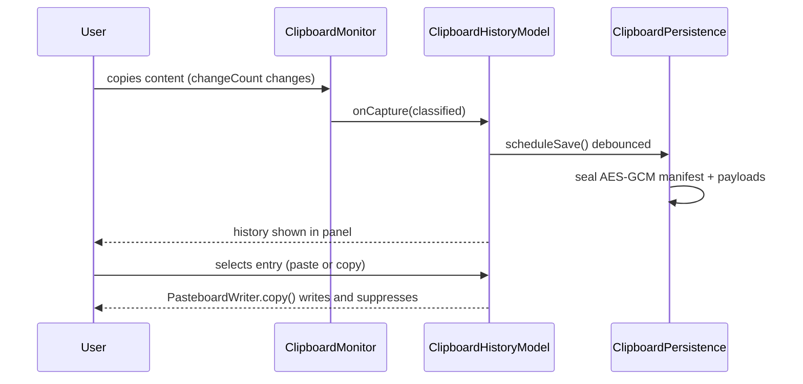

# Clipboard history capture, persistence, and restore

_Last reviewed: 2026-08-13_

EasyKey captures every external clipboard change into a searchable history, optionally seals it to disk, and restores an entry by rewriting the pasteboard (and optionally pasting into the previously focused app). The clipboard panel, its hotkey, and the status menu all rely on this flow.

## Trigger and actors

**Trigger:** upstream event — `NSPasteboard.general` change count changes while capture is enabled (`ClipboardMonitor` polls every 0.3 s, `ClipboardMonitor.swift:21`); and a user action — the clipboard hotkey (default Option+V, key code 9, `ClipboardOptions.swift:17`) or an entry selection in the panel.

**Preconditions:** clipboard feature started via `ClipboardServices.start(loadPersisted:)`; capture enabled (`isCaptureEnabled`) with at least one captured kind; the app itself is not the source of the pasteboard write (own writes are suppressed).

**Actors:**

- **User** — copies content, presses the hotkey, selects, pins, or deletes entries.
- **ClipboardMonitor** — poll timer, sensitive/own-write rejection, hands classified events to the model (`ClipboardMonitor.swift:71`).
- **PasteboardClassifier** — translates an immutable snapshot into a fingerprint-identified `ClipboardEntry` plus binary payloads (`PasteboardClassifier.swift:43`).
- **ClipboardHistoryModel** — transactional staging, pruning, payload eviction, limits, debounced save (`ClipboardHistoryModel.swift:69`).
- **ClipboardPersistence** — AES-GCM sealing of the manifest and payload files (`ClipboardPersistence.swift:53`).
- **ClipboardKeyStore** — 256-bit key provisioning in the device-only, non-synchronizing Keychain (`ClipboardKeyStore.swift:20`).
- **ClipboardPanelPresenter / PasteboardWriter** — panel presentation and the single write boundary for restores.
- **ClipboardActionCoordinator** — selection actions (copy only, or write + reactivate previous app + synthesize paste).

## Happy path

1. **Pasteboard change detected.** The poll timer invokes `ClipboardMonitor.poll()`, which re-reads `changeCount` and proceeds only when it differs from the observed count and capture is enabled (`ClipboardMonitor.swift:71-74`).
2. **Content classified, own writes suppressed.** The monitor skips events the `ClipboardWriteSuppressor` marked as EasyKey-authored, re-verifies the descriptor count, rejects sensitive marker types, and lets `PasteboardClassifier.classify` produce a `ClassifiedClipboard` — a SHA-256 fingerprint over canonical representations plus payloads keyed by reference (`PasteboardClassifier.swift:141`).
3. **Capture staged as one transaction.** `ClipboardHistoryModel.capture` inserts the entry into a candidate history, computes payload eviction (orphans dropped, new references kept), and projects the retained-byte total; only then does it commit history and payloads together (`ClipboardHistoryModel.swift:69-93`).
4. **History sealed to disk (when persistence is on).** `scheduleSave` debounces, then `ClipboardPersistence.save` seals the JSON manifest and each payload file with AES-GCM and writes them atomically (`ClipboardPersistence.swift:53-85`).
5. **Key provisioned.** `ClipboardPersistence.save` uses `keyProvider.existingKey() ?? keyProvider.createKey()`; `KeychainClipboardKeyStore` stores the key as `kSecAttrAccessibleWhenUnlockedThisDeviceOnly` with `kSecAttrSynchronizable: false` (`ClipboardKeyStore.swift:42-68`).
6. **History shown in the clipboard panel.** The hotkey or status menu toggles `ClipboardPanelPresenter.show`, which hosts `ClipboardPanelView` beside the pointer and remembers the previously active application (`ClipboardPanelPresenter.swift:51-61`).
7. **Entry restored.** `PasteboardWriter.copy` rebuilds `NSPasteboardItem`s (string, file URL, or payload-referenced data representations), clears the pasteboard, writes them, and calls `suppressor.markWritten(changeCount:)` so the resulting change is not re-captured (`PasteboardWriter.swift:67-107`).

## Branches and rules

Branches ordered by how often the trigger actually takes them.

### Persistence disabled (memory-only history)

**Branches from step:** 4

**Condition:** `ClipboardOptions.persistsHistory == false` (the default, `ClipboardOptions.swift:21`).

**Then:** `scheduleSave` returns without scheduling (`ClipboardHistoryModel.swift:216`); capture, pin, delete, and prune still mutate the in-memory history and payload store, and `loadPersistedHistory` is skipped at start (`ClipboardServices.swift:137-144`). Turning persistence off while it was on bumps the generation and deletes disk state and the key (`ClipboardHistoryModel.swift:131-136`).

**Rejoins at:** step 6 (panel still shows the memory-only history).

### Duplicate fingerprint replaces in place

**Branches from step:** 3

**Condition:** the incoming entry's SHA-256 fingerprint equals an existing entry's fingerprint.

**Then:** `ClipboardHistory.insert` removes the old entry and inserts the new one at the top; if the old entry was pinned, the new entry inherits the pin state and original `pinnedAt`, preserving pin order (`ClipboardHistory.swift:33-46`).

**Rejoins at:** step 3 (same eviction/commit path).

### Own write, sensitive markers, or ignored app

**Branches from step:** 2

**Condition:** the change count matches `ClipboardWriteSuppressor.shouldSuppress`; the descriptor items carry any `SensitivePasteboardMarkers` identifier (e.g. `org.nspasteboard.ConcealedType`, `com.agilebits.onepassword`); or the frontmost app's bundle identifier is in `ignoredApplicationBundleIdentifiers`.

**Then:** `poll` re-syncs `observedChangeCount` and returns before any payload byte is read (`ClipboardMonitor.swift:76-98`; `PasteboardSnapshot.swift:14-27`).

**Rejoins at:** step 1 (next poll).

### Capture disabled or no captured kinds

**Branches from step:** 1

**Condition:** `!options.isCaptureEnabled || options.capturedKinds.isEmpty`.

**Then:** `poll` returns immediately; `ClipboardServices.apply` stops the monitor timer when capture turns off (`ClipboardMonitor.swift:72`; `ClipboardServices.swift:152-158`).

**Rejoins at:** step 1 when capture is re-enabled (with `refreshObservedCount` so pre-existing contents are not replayed).

### Payload byte limit reached

**Branches from step:** 3

**Condition:** the projected retained byte total exceeds `ClipboardLimits.maximumRetainedBytes` (100 MB, `PasteboardSnapshot.swift:7`), or `payloadStore.insert` fails; per-event bytes over 10 MB are rejected earlier by the snapshot and classifier (`PasteboardSnapshot.swift:102`, `PasteboardClassifier.swift:62`).

**Then:** the candidate is rejected untouched — history and payload store are unchanged — and `limitNotice = .payloadLimitReached` is published (`ClipboardHistoryModel.swift:80-89`).

**Rejoins at:** step 6 (panel shows the notice); the capture itself is dropped.

### Pinned limit reached

**Branches from step:** 6 (panel pin action)

**Condition:** pinning would exceed `ClipboardHistory.maximumPinnedEntries` (25, `ClipboardHistory.swift:17`).

**Then:** `setPinned` returns `.pinnedLimitReached`, the entry stays unpinned, and `limitNotice = .pinnedLimitReached` is published (`ClipboardHistoryModel.swift:95-106`). No pinned entry is ever silently evicted.

**Rejoins at:** step 6.

### Clear all and clear unpinned

**Branches from step:** 6 (panel actions)

**Condition:** the user chooses "clear all" or "clear unpinned".

**Then:** `clearAll()` cancels pending saves, advances the generation so no queued save can commit, clears memory and payloads, then deletes the persistence directory and the Keychain key; `clearUnpinned()` removes only unpinned entries and commits (`ClipboardHistoryModel.swift:114-157`).

**Rejoins at:** step 6 (empty or pinned-only history shown).

### Restore selection action: paste immediately vs copy-only

**Branches from step:** 7

**Condition:** `ClipboardOptions.selectionAction` is `.pasteImmediately` (default) or `.copyOnly`.

**Then:** `.copyOnly` writes the entry and closes the panel; `.pasteImmediately` additionally reactivates the previous application and, when it is still focused, synthesizes Command-V (with a 120 ms delay) after `ClipboardActionCoordinator` verifies focus (`ClipboardActionCoordinator.swift:44-108`; `ClipboardServices.swift:76`).

**Rejoins at:** ends the flow.

**Other rules:** retention pruning is age- and count-based — `retentionDays` (default 7) removes expired unpinned entries, `maximumEntryCount` (default 100) caps unpinned entries (`ClipboardHistory.swift:83-97`); captured kinds filter which content types are stored (`ClipboardOptions.swift:36-43`); a same-fingerprint duplicate never creates a second entry.

## Failure and recovery

Ordered by blast radius, most severe first. Evidence is the error paths and notices in the code.

### Persistence save or load failure

**Detected by:** `ClipboardPersistence.save/load` throwing (`ClipboardPersistenceError`), caught in `performSave` and `loadPersistedHistory` (`ClipboardHistoryModel.swift:243-258`, `159-181`).

**Immediate response:** fail fast — memory history stays the source of truth; `persistenceError` is published and the panel surfaces it. A failed load leaves the history empty.

**State left behind:** the previous disk state (if any) remains on disk; the failed save is not retried automatically — the next mutation schedules a new debounced save.

**Recovery:** any subsequent successful save clears `persistenceError`; the user can re-run the flow (new capture, pin, delete) to trigger it.

**Escalation boundary:** none — errors are user-visible state, not an operator handoff.

### Decryption or key failure on load

**Detected by:** `AES.GCM.open` failure → `ClipboardPersistenceError.decryptionFailed`, or missing key → `.keyUnavailable`, or schema/oversize violations → `.malformedDocument`/`.unsupportedSchema` (`ClipboardPersistence.swift:87-127`, `138-145`).

**Immediate response:** fail fast; `persistenceError` is set and the flow continues with an empty in-memory history.

**State left behind:** sealed files remain on disk but are not touched — a later clear-all deletes them along with the key.

**Recovery:** user clears history (which deletes disk state and key, `ClipboardHistoryModel.swift:141-157`) and capture resumes fresh; a new key is created on the next save.

**Escalation boundary:** none.

### Restore payload unavailable

**Detected by:** `PasteboardWriter.makeItems` — a file URL whose file no longer exists (`PasteboardWriteError.unavailableRepresentation`) or a payload reference missing from the store (`PasteboardWriter.swift:74-107`).

**Immediate response:** the action fails with `lastError = .unavailable`; the panel stays open; no paste is synthesized.

**State left behind:** nothing is written; the entry remains in history.

**Recovery:** user retries or picks another entry — the pasteboard is never partially written because items are fully built before `writeObjects` (`PasteboardWriter.swift:67-71`).

**Escalation boundary:** none.

### Hotkey registration conflict

**Detected by:** `RegisterEventHotKey` returning non-zero in `CarbonHotKeyRegistrar`; `ClipboardHotKeyController.apply` returns `false` and sets `hasConflict` (`ClipboardHotKeyController.swift:39-69`).

**Immediate response:** fail fast — the previous binding stays registered; the panel still opens via the status menu; `hotkeyConflict` is published.

**State left behind:** no partial registration (the new identifier is only unregistered if it succeeded).

**Recovery:** user changes the shortcut in settings; `apply` retries with a fresh identifier.

**Escalation boundary:** none.

### Paste focus lost or accessibility denied

**Detected by:** `ClipboardActionCoordinator` — the previous application is terminated (`.targetTerminated`), no longer frontmost (`.focusChanged`), or `AXIsProcessTrusted()` is false so `synthesizePaste` returns false (`.accessibilityDenied`) (`ClipboardActionCoordinator.swift:65-108`; `ClipboardServices.swift:192-208`).

**Immediate response:** the entry was already written to the pasteboard; the error is recorded and surfaced in the panel.

**State left behind:** the pasteboard holds the restored content — the user can paste manually; safe to repeat.

**Recovery:** user pastes manually or re-opens the panel.

**Escalation boundary:** none.

## Outcome

**On success:** the captured entry is committed to memory history (and, when enabled, AES-GCM sealed to disk under a device-only Keychain key); a restore rewrites the full representation set to `NSPasteboard.general` and marks the write so it is not re-captured; with `.pasteImmediately` the previously focused app receives a synthesized Command-V.

**On safe failure:** capture is transactional — a rejected candidate leaves history, payloads, and disk untouched, and memory history never depends on a successful save.

**Deferred work:** debounced saves continue after each mutation and are flushed on stop (`flushPendingSave`, `ClipboardServices.swift:173-179`); disabling persistence asynchronously deletes disk state and the key.

> **Related:** [Flows index](README.md) tracks discovery status and priority for this flow.
