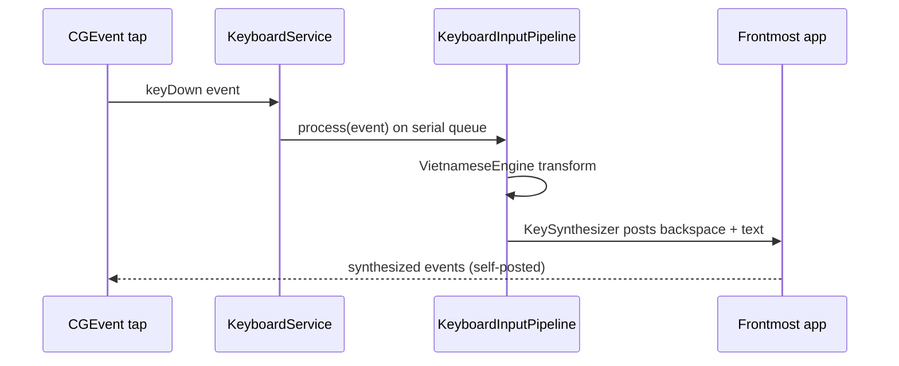

# Keyboard typing transformation (Telex/VNI)

_Last reviewed: 2026-08-03_

EasyKey intercepts system-wide keystrokes and transforms them into Vietnamese text per the active input method (Telex, Simple Telex, or VNI) before they reach the frontmost app, and expands macro triggers while typing. The keyboard service, its health/pause states, and the Smart Switch per-app language override all hang off this flow.

## Trigger and actors

**Trigger:** upstream event — every system-wide `CGEvent` (key down/up, flags change, mouse) matching the tap's event mask is delivered to the session event tap; typing becomes transformation when the event is a character key with the Vietnamese language active.

**Preconditions:** `KeyboardService.start()` ran and the Accessibility permission is granted (`AXIsProcessTrusted()`) — the tap is installed only then; the service is not paused.

**Actors:**

- **KeyboardEventTap** — owns the CGEvent tap (session tap, head insertion), its run-loop source, and sleep/wake observers (`KeyboardEventTap.swift:32-57`).
- **KeyboardService** — routes tap events on a serial queue, tracks health, pause, and permission, and recovers disabled taps.
- **KeyboardInputPipeline** — applies shortcuts, per-app rules, engine transformation, macros, and Spotlight/Chromium workarounds; owns the engine, synthesizer, and macro expander (`KeyboardInputPipeline.swift:19-79`).
- **VietnameseEngine + TelexComposer** — the streaming Telex/VNI transformation and buffer recomposition (`VietnameseEngine.swift:26`, `TelexComposer.swift:70`).
- **KeySynthesizer** — emits replacement key events and marks them as self-posted.
- **WorkspaceObserver / SmartSwitchController** — per-application language and encoding overrides.
- **KeyboardDiagnosticsRecorder** — ring-buffer telemetry for health reporting.

## Happy path

1. **CGEvent tap captures system-wide keys.** `KeyboardEventTap.install` creates a `.cgSessionEventTap` at `.headInsertEventTap` for key and mouse events and adds its run-loop source; the callback runs on the main thread and forwards to `KeyboardService.handleTapEvent` (`KeyboardEventTap.swift:32-57`, `102-114`).
2. **KeyboardService routes the event.** `handleTapEvent` lets self-posted events pass through untouched (`KeySynthesizer.isSelfPosted`), recovers `.tapDisabledByTimeout`/`.tapDisabledByUserInput` events, and runs `pipeline.process` on the serial `processingQueue`; a result with `suppressesOriginal` returns `nil` so the original event never reaches the app (`KeyboardService.swift:206-233`).
3. **Pipeline applies transformation with Smart Switch language.** `process` checks the emergency pause shortcut, ignored applications (bypass + session reset), flags changes, mouse events (composition reset), the language-switch shortcut, the restore-word shortcut, and macros; when the language is Vietnamese and the input source is usable it normalizes the event and calls `engine.process` (`KeyboardInputPipeline.swift:146-209`).
4. **Engine transforms per Telex/VNI rules.** `VietnameseEngine.process` feeds each keystroke into the buffer; `TelexComposer.compose` recomputes atoms and tone per keystroke — ordered tone placement (`toneTargetIndex`), position-free marks, repeat-to-undo (`PendingUndo`), checked-final tone restriction, quick consonants, standalone `w`/bracket shortcuts, and VNI digit rules (`VietnameseEngine.swift:75-162`; `TelexComposer.swift:70-96`, `102-137`). Word boundaries flush the word with spell-check restoration rules (`VietnameseEngine.swift:164-197`).
5. **Macro expansion with loop detection.** `MacroExpander.consume` accumulates the trigger up to `MacroStore.maximumTriggerLength` and expands on a delimiter key (space, tab, return) when macros are enabled; `inMacroExpansion` guards re-entry as a secondary defense, and the primary defense is `KeySynthesizer.isSelfPosted` on the emitted events (`KeySynthesizer.swift:365-428`, `343-362`).
6. **KeySynthesizer emits transformed output.** The pipeline's `apply` turns engine edits into posted events: `replaceBackward` (focused-text atomic replacement, selection replacement for Spotlight, physical backspace, or autocomplete-breaking), `deleteBackward`, and `insert` of unicode events tracked as encoded units; compatibility workarounds insert empty characters where needed (`KeyboardInputPipeline.swift:236-285`; `KeySynthesizer.swift:87-164`).

## Branches and rules

Branches ordered by how often the trigger actually takes them.

### Accessibility permission missing or revoked

**Branches from step:** 1

**Condition:** `AXIsProcessTrusted()` is false at start, on refresh, or after wake.

**Then:** the event tap is torn down and health is `.requestingPermission`; `requestAccessibilityPermission` re-prompts the system dialog; every application activation and wake re-checks the permission (`KeyboardService.swift:91-113`; `AppCoordinatorWiring.swift:94-107`).

**Rejoins at:** step 1 when the user grants permission and `refreshPermission` reinstalls the tap.

### Keyboard paused (emergency pause)

**Branches from step:** 2

**Condition:** the user hits the emergency pause shortcut (default Control+Option+Command, `KeyboardService.swift:34-37`) or toggles pause from the menu; the pipeline matches it before any other handling (`KeyboardInputPipeline.swift:147-150`).

**Then:** `setPaused` tears down the tap, sets health `.stopped`, and publishes the pause state; unpausing re-runs `startIfPermitted` (`KeyboardService.swift:168-183`).

**Rejoins at:** step 1 when unpaused.

### Ignored application

**Branches from step:** 3

**Condition:** the active application's bundle identifier is in `settings.compatibility.ignoredApplicationBundleIdentifiers`.

**Then:** the session is reset and the event is passed through untouched (disposition `.bypassed`) (`KeyboardInputPipeline.swift:152-156`).

**Rejoins at:** step 1 (next event).

### Foreign input source without other-language support

**Branches from step:** 3

**Condition:** the current keyboard input source is foreign (no English in `kTISPropertyInputSourceLanguages`) and `settings.compatibility.otherLanguageSupport` is off.

**Then:** the event passes through and the session resets (`KeyboardInputPipeline.swift:188-193`, `570-579`); `KeyboardService.refreshInputSource` recomputes this on wake and start.

**Rejoins at:** step 1.

### Spotlight window active

**Branches from step:** 6

**Condition:** `SpotlightWindowDetector.isSpotlightWindowVisible()` is true (an on-screen window owned by the Spotlight process; cached 0.3 s), or the app compatibility rule includes the spotlight workaround.

**Then:** replacement uses shift-arrow selection plus insertion instead of backspaces, and autocomplete breaking is enabled (`KeyboardInputPipeline.swift:236-239`, `304-324`, `367-380`; `SpotlightWindowDetector.swift:12-20`).

**Rejoins at:** step 6.

### Chromium address bar

**Branches from step:** 6

**Condition:** the focused element is a Chromium address bar (`FocusedElementInspector.isChromiumAddressBar`, cached 1.5 s) or the compatibility rule says so.

**Then:** `shouldBreakAutocomplete` inserts a narrow no-break space and backspaces it before replacing, breaking inline autocomplete; the empty-character workarounds are skipped (`KeyboardInputPipeline.swift:274-280`, `508-514`).

**Rejoins at:** step 6.

### Smart Switch per-app language override

**Branches from step:** 3

**Condition:** Smart Switch is enabled and the frontmost application changes (`NSWorkspace.didActivateApplicationNotification`).

**Then:** `SmartSwitchController.handleApplicationActivation` resolves the remembered choice for the app identity — applying language (and encoding when `rememberEncoding`) — or records the current choice on first focus; the coordinator then pushes `input.language` through settings into the pipeline's engine configuration; ignored and self apps are exempt (`WorkspaceObserver.swift:11-53`; `SmartSwitchController.swift:60-126`; `AppCoordinatorWiring.swift:215-222`).

**Rejoins at:** step 3 (new session for the activated app).

### Language toggle and restore-word shortcuts

**Branches from step:** 3

**Condition:** the configured switch shortcut (keyDown or flagsChanged) or the restore-word shortcut matches with Vietnamese active.

**Then:** the switch shortcut toggles the input language and suppresses the event; the restore shortcut calls `VietnameseEngine.restoreRawKeys`, which replaces the composed word with the raw keystrokes and freezes transformation per word (`KeyboardInputPipeline.swift:175-182`, `456-483`; `VietnameseEngine.swift:60-73`).

**Rejoins at:** step 1 (switch) or step 6 (restore edits are applied and posted).

**Other rules:** sentence-start capitalization applies per configuration when the buffer is empty (`VietnameseEngine.swift:90-95`); spell check with `autoRestoreKeys` decides whether an invalid composed word reverts to raw keys at word boundaries (`VietnameseEngine.swift:187-197`); mouse events and flags changes always reset composition state (`KeyboardInputPipeline.swift:158-167`).

## Failure and recovery

Ordered by blast radius, most severe first. Evidence is the health states and recovery paths in `KeyboardService`.

### Event tap install failure

**Detected by:** `CGEvent.tapCreate` or run-loop source creation returning nil (`KeyboardEventTap.swift:38-49`).

**Immediate response:** fail fast — the tap is not installed and health becomes `.failed` (`KeyboardService.swift:198-203`).

**State left behind:** no tap exists; keystrokes pass through untouched.

**Recovery:** `restartKeyboardService` in the status menu (or the app coordinator) stops and restarts the service, re-running permission checks (`AppCoordinator.swift:310-319`).

**Escalation boundary:** none — the status item shows health; the user restarts the service.

### Tap disabled by system

**Detected by:** `.tapDisabledByTimeout` or `.tapDisabledByUserInput` events in `handleTapEvent`.

**Immediate response:** the event passes through, the diagnostic is recorded with disposition `.disabled`, and `recoverTapAfterDisable` tears the tap down, sets health `.degraded`, and re-checks permission (`KeyboardService.swift:215-242`).

**State left behind:** composition state is lost with the tap teardown; the original event reached the app.

**Recovery:** automatic — `refreshPermission` reinstalls the tap once trusted.

**Escalation boundary:** none.

### Sleep and wake

**Detected by:** `NSWorkspace.willSleepNotification` / `didWakeNotification` workspace observers (`KeyboardEventTap.swift:74-92`).

**Immediate response:** on sleep the tap is torn down and health becomes `.degraded`; on wake the input source and permission are refreshed (`KeyboardService.swift:66-83`).

**State left behind:** the session is reset (`AppCoordinatorWiring.swift:102-106`).

**Recovery:** automatic on wake — `startIfPermitted` reinstalls the tap.

**Escalation boundary:** none.

### Output synthesis failure

**Detected by:** `KeySynthesizer` event-creation failures (`makeUnicodeEvents`/`makePhysicalKeyEvents` returning nil, or a replacement strategy of `.failed`); `apply` returns false.

**Immediate response:** the session resets and the original event passes through unmodified (`KeyboardInputPipeline.swift:204-208`, `264-266`).

**State left behind:** composition is cleared; the app received raw keystrokes.

**Recovery:** the user simply keeps typing — the next keystroke starts a fresh session.

**Escalation boundary:** none.

## Outcome

**On success:** each keystroke either passes through or is replaced by synthesized events that render the correctly composed Vietnamese word in the frontmost app; macro triggers expand; health is `.active`; diagnostics feed the latency and disposition telemetry (`KeyboardDiagnosticsRecorder.swift:30-49`).

**On safe failure:** when transformation cannot be applied, the original event is always delivered — the app never loses a keystroke, and self-posted output never loops back through the engine.

**Deferred work:** diagnostics continue recording after each event; Smart Switch records remembered choices after the user manually switches language (`SmartSwitchController.swift:128-162`).

> **Related:** [Flows index](README.md) tracks discovery status and priority for this flow.
