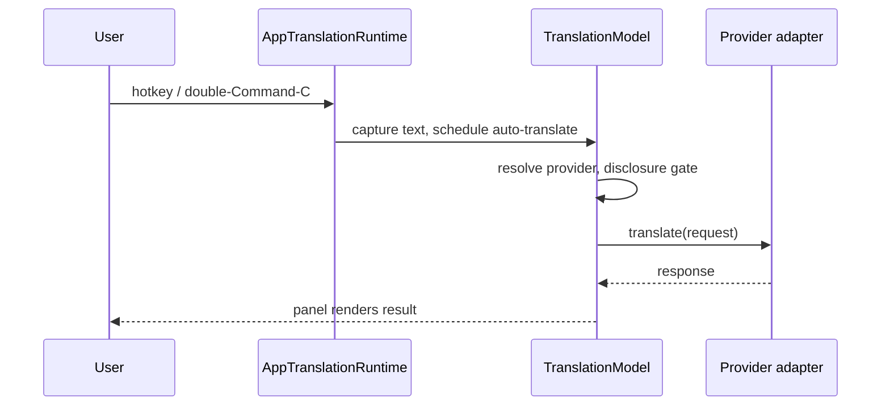

# Translation via on-device or cloud providers

_Last reviewed: 2026-08-03_

EasyKey captures the selected text (or the user's typed input), resolves an on-device or cloud provider, and renders a translation in the floating panel or the menu-bar popover. The translate hotkey, the double-Command-C gesture, and the menu popover all drive this flow.

## Trigger and actors

**Trigger:** user action — the translation hotkey registered with Carbon (`CarbonTranslationHotKeyRegistrar`, `TranslationHotKeyController.swift:141`), a double Command-C press detected by the keyboard pipeline, or the menu-bar popover's translate affordance; each routes to `AppTranslationRuntime.activate()` (`AppTranslationRuntime.swift:317-335`).

**Preconditions:** translation is enabled (`TranslationOptions.isEnabled`); the runtime has started (`start()`); for selected-text capture, the accessibility fallback needs the app to be trusted.

**Actors:**

- **User** — presses the hotkey, edits source text, chooses a provider.
- **AppTranslationRuntime** — activation, provider registry, disclosure gate, hotkey lifecycle.
- **SelectedTextCaptureCoordinator** — reads the frontmost app's selected text via accessibility, with a simulated Command-C fallback (`SelectedTextCapture.swift:145-205`).
- **TranslationModel** — shared state, auto-translate scheduling, request dispatch, stale-result guarding.
- **TranslationProviderResolver** — deterministic provider selection (`TranslationProviderResolver.swift:72-93`).
- **TranslationDisclosureController** — first-use cloud-transmission consent gate.
- **TranslationCredentialStore** — per-provider API keys in the device-only Keychain.
- **Provider adapters (TranslationProviding)** — Apple on-device and cloud adapters (DeepL, Google, OpenAI, Anthropic, Gemini, OpenRouter, Groq, compatible endpoints).
- **TranslationPanelView / menu popover** — result rendering.

## Happy path

1. **Activation.** The Carbon hotkey handler, double-Command-C detector, or popover calls `activate()`; it returns when `isEnabled` is false, otherwise captures the previously active application and shows the panel (`AppTranslationRuntime.swift:325-335`).
2. **Source text submitted.** `SelectedTextCaptureCoordinator.capture` reads `AXSelectedText` from the focused element (text field, text area, web area, etc.); if that is unavailable, it simulates Command-C in the previous application and restores the pasteboard; the result lands in `model.setSourceText` (`SelectedTextCapture.swift:169-205`; `TranslationModel.swift:56-61`).
3. **Auto-translate scheduled.** `scheduleAutoTranslate` sleeps for the configured delay (`autoTranslateDelayMs`, presets 250–1500 ms, default 500 ms) then calls `translate()`; every source edit cancels and reschedules the timer (`TranslationModel.swift:218-231`; `TranslationOptions.swift:78-88`).
4. **Provider resolved.** `TranslationProviderResolver.resolveEffectiveProvider` picks the explicit preference when available; otherwise Apple on macOS 15+, otherwise the first configured cloud provider in `cloudProviderOrder`; nothing available resolves to `.setupRequired` (`TranslationProviderResolver.swift:72-93`).
5. **First-use cloud disclosure gate.** For a cloud provider not yet acknowledged, `TranslationDisclosureController.request` shows an alert naming the provider (and endpoint origin when custom); declining stops the request (`AppTranslationRuntime.swift:48-65`).
6. **Credentials read.** Cloud adapters fetch their key from `KeychainTranslationCredentialStore` — one account per provider, `kSecAttrAccessibleWhenUnlockedThisDeviceOnly`, `kSecAttrSynchronizable: false` (`TranslationCredentialStore.swift:76-155`).
7. **Request dispatched.** `TranslationModel.translate` looks the provider up in the registry and calls `provider.translate(request)` inside a cancellable task; adapters use an ephemeral `URLSession` (no cache, cookies, or credential storage) and validated HTTPS endpoints (`TranslationModel.swift:145-191`; `TranslationProviding.swift:73-90`).
8. **Response rendered.** The panel or popover binds `model.status`; a matching generation applies `.succeeded(response)` or `.failed(error)`, and stale responses from cancelled or superseded requests are dropped (`TranslationModel.swift:252-264`).

## Branches and rules

Branches ordered by how often the trigger actually takes them.

### Automatic provider resolution falls back to Apple or first configured cloud provider

**Branches from step:** 4

**Condition:** `preferredProviderID` is nil (Automatic) — or names a provider that is not currently available (e.g. a saved Apple preference on macOS 14) — and the platform supports Apple translation or at least one cloud provider has credentials.

**Then:** Apple wins when the platform supports it; otherwise the first configured provider in `cloudProviderOrder` (DeepL, Google, OpenAI, Anthropic, Gemini, OpenRouter, Groq, OpenAI-compatible, Anthropic-compatible) is resolved; with nothing usable, resolution is `.setupRequired` and the model ends with `.noProviderConfigured`. The saved preference is never overwritten (`TranslationProviderResolver.swift:47-93`).

**Rejoins at:** step 5.

### Cloud disclosure declined

**Branches from step:** 5

**Condition:** the provider is a cloud provider in `cloudProviderOrder`, the user has not acknowledged it (per-provider in settings, or per endpoint-origin in memory), and the user cancels the alert.

**Then:** `TranslationModel` finishes with `.cancelled`; no network request is made (`AppTranslationRuntime.swift:48-65`; `TranslationModel.swift:172-183`).

**Rejoins at:** ends the flow (status shows the cancelled error; source text is preserved).

### Provider missing credentials or unsupported on platform

**Branches from step:** 4

**Condition:** the resolved provider's adapter cannot be constructed — `configuredCloudProviders` excludes it (no Keychain credential) or Apple is not supported on macOS 14 and earlier (`TranslationProviderResolver.swift:31-45`).

**Then:** `TranslationProviderResolver.availability` reports `.missingCredentials` or `.unsupportedOnPlatform`; `makeAppleComponents` never registers Apple on unsupported systems; the model's `providerLookup` returns nil and `translate()` fails with `.noProviderConfigured` (`TranslationModel.swift:148-150`).

**Rejoins at:** step 1 — saving a credential or upgrading macOS triggers `refreshProviders`, which re-resolves and updates the model's provider (`AppTranslationRuntime.swift:360-385`).

### Each source edit reschedules the auto-translate delay

**Branches from step:** 3

**Condition:** the user edits source text (`setSourceTextFromUserInput`) or the source changes programmatically with a non-blank result.

**Then:** the pending auto-translate task is cancelled and re-scheduled with the configured delay; a blank source never schedules (`TranslationModel.swift:63-71`, `218-231`).

**Rejoins at:** step 3 (new countdown).

### Session persistence: clear on close

**Branches from step:** 8

**Condition:** `TranslationOptions.sessionPersistence == .clearOnClose` (default is `.keepUntilRestart`).

**Then:** `handleSurfaceClosed` calls `model.clearSession()`, wiping source text and result but keeping provider and language selections (`AppTranslationRuntime.swift:302-309`; `TranslationModel.swift:208-212`).

**Rejoins at:** step 1 (next activation starts blank).

### Pronunciation only for Apple and Google

**Branches from step:** 8

**Condition:** the active provider is Apple or Google (the only providers `TranslationPronunciationPolicy.supports`).

**Then:** `TranslationSpeechController` can speak the result; switching to any other provider stops speech (`TranslationModel.swift:5-9`, `105-113`).

**Rejoins at:** step 8.

**Other rules:** source text is capped at `TranslationRequest.maximumSourceTextLength` (5000 chars) and a blank source or an explicit source equal to the target silently produces no request (`TranslationRequest.swift:8-36`); only preset auto-translate delays are accepted by the settings model (`TranslationSettingsModel.swift:315-319`); endpoint-validating adapters only accept https URLs whose host passes `HostSafety.validate` (`TranslationProviding.swift:35-71`).

## Failure and recovery

Ordered by how often they occur. Evidence is the normalized `TranslationError` set and per-adapter handling.

### No provider configured or credentials missing

**Detected by:** resolution returning `.setupRequired`, or `providerLookup` returning nil in `translate()`.

**Immediate response:** fail fast — `status = .failed(.noProviderConfigured)`; the panel disables the translate affordance (`TranslationModel.swift:145-150`).

**State left behind:** nothing queued; source text remains editable.

**Recovery:** user saves credentials in settings (or macOS is upgraded to 15+); `settingsModel.onCredentialsChange` triggers `refreshProviders` and the provider is re-resolved.

**Escalation boundary:** none.

### Network failure or timeout

**Detected by:** `URLError` mapping in the adapters — `.notConnectedToInternet`, `.networkConnectionLost`, `.dataNotAllowed`, `.internationalRoamingOff` become `.networkUnavailable`; `.timedOut` becomes `.requestTimedOut` (e.g. `DeepLTranslationProvider.swift:192-203`); Anthropic caps requests at 100 KB and 20 s timeouts (`AnthropicTranslationProvider.swift:8-13`).

**Immediate response:** the request fails; `status = .failed(...)`; the user's source text and selections survive.

**State left behind:** no partial result is applied (generation guard); repeating the flow is safe.

**Recovery:** user re-triggers the hotkey or edits the source — the flow is idempotent from the user's perspective.

**Escalation boundary:** none.

### Provider HTTP error or invalid response

**Detected by:** non-2xx status or a malformed/undersized provider body; adapters throw `.rateLimitExceeded`, `.providerUnavailable(provider:httpStatus:)`, `.requestTooLarge`, or `.invalidResponse`.

**Immediate response:** fail fast; the error is normalized by `TranslationModel.normalize` and published to the panel (`TranslationModel.swift:275-283`).

**State left behind:** nothing persisted; the request is safe to repeat.

**Recovery:** user retries later; for rate limits, waiting for the window is the only path.

**Escalation boundary:** none.

### Apple language pack not installed

**Detected by:** `AppleTranslationProvider.checkAvailability` — the Apple translation `LanguageAvailability` status is `.supported` but not `.installed`.

**Immediate response:** fail fast with `.appleLanguageDownloadRequired`; `.unsupported` pairs fail with `.unsupportedLanguagePair` (`AppleTranslationProvider.swift:60-77`).

**State left behind:** the system downloads the language pack; the request itself is not retried.

**Recovery:** user re-triggers translation after the pack is installed.

**Escalation boundary:** none.

### Cancellation mid-flight

**Detected by:** the request task being cancelled — panel dismissed, popover collapsed, app stopping, or a newer request superseding it.

**Immediate response:** `.cancelled` is finished only if the generation still matches; otherwise the stale result is discarded silently (`TranslationModel.swift:162-191`, `252-264`).

**State left behind:** the in-flight request is aborted; source text and selections are untouched.

**Recovery:** the next activation starts a fresh request.

**Escalation boundary:** none.

## Outcome

**On success:** the translated response is rendered in the floating panel or menu popover with `status = .succeeded`; Apple and Google results can be spoken aloud. No source text, translation, prompt, or credential is persisted (`TranslationOptions.swift:4-6`).

**On safe failure:** `status = .failed` with a normalized, display-safe `TranslationError`; source text and provider/language selections remain intact, and no stale or partial result is ever applied.

**Deferred work:** speech reading (Apple/Google) continues asynchronously after the panel closes; provider re-resolution runs on credential changes and settings apply.

> **Related:** [Flows index](README.md) tracks discovery status and priority for this flow.
