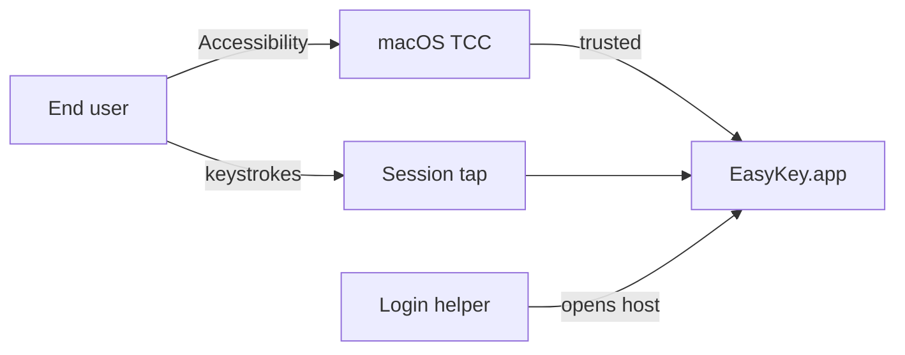

# Security

_Last reviewed: 2026-08-27_

This file is the compact security section for engineers and beginners who need a verified posture, not a disclosure procedure. It answers what EasyKey protects (keystrokes, optional clipboard history, translation secrets and text, the update channel) and what the repository actually tests. How to report a vulnerability is owned by the root [SECURITY.md](../SECURITY.md), not here.

## At a glance

EasyKey.app is unsandboxed so a session CGEvent tap can run after macOS Accessibility (TCC) trust; EasyKeyLoginHelper.app is sandboxed and only launches the host. Optional clipboard history is AES-GCM sealed under a this-device Keychain key. Cloud translation credentials are the same Keychain class; source text leaves the Mac only from translation surfaces after a first-use disclosure. Sparkle starts only when the bundle has an HTTPS feed and a non-empty EdDSA public key. Architecture fitness tests keep translation secrets out of logs and persisted settings.

Reading paths: start with the [threat model](#threat-model) for zones and STRIDE; [data handling](#data-handling) for classes and lifecycle; [platform permissions](#platform-permissions) for Accessibility and launch-at-login. Structure lives in [architecture.md](architecture.md); runtime order in [flows.md](flows.md); user-visible limits in [reference.md](reference.md).

| Topic | Answers |
|---|---|
| [Threat model](#threat-model) | What can go wrong, and what actually stops it? |
| [Data handling](#data-handling) | What data classes does this system hold, and how is each collected, retained, and deleted? |
| [Platform permissions](#platform-permissions) | What does this app ask permission for, and what happens if I say no or revoke it later? |

## Scope and boundaries

This file owns posture, the bounded DFD, STRIDE responses, data classes, and requested capabilities. Adjacent sections own the rest: [architecture.md](architecture.md) (blocks, sandbox contrast, Team ID launch debt as engineering debt), [flows.md](flows.md) (ordered runtime), [product.md](product.md) (what ships and non-goals), [engineering.md](engineering.md) (build and Sparkle release channel), [operations.md](operations.md) (CI versus notarized DMG), [reference.md](reference.md) (settings and limits), [concepts.md](concepts.md) (vocabulary when entries exist), [decisions.md](decisions.md) (ADRs when entries exist). The compact security folder has no unmerged sibling files. Reporting, supported scope, and response expectations stay in [SECURITY.md](../SECURITY.md). This file does not host a scored interaction register (not selected for this run).

## Threat model

Assets: the session keystroke stream, optional clipboard history and its AES key, cloud translation credentials and source text, and the Sparkle update path. Trust zones: the user's session and other apps; unsandboxed EasyKey.app; sandboxed EasyKeyLoginHelper.app; macOS Keychain (this-device generic passwords); Application Support clipboard files; HTTPS to cloud translation and to the Sparkle appcast. External entities: the end user, macOS TCC, cloud translation endpoints, and the Sparkle feed/enclosure hosts. Processes: the CGEvent tap and keyboard pipeline, clipboard persistence, translation runtime, Sparkle updater, login helper. Stores: Keychain items, sealed clipboard files, settings on disk (no translation secrets). Flows: keystrokes through the tap, pasteboard snapshots, opt-in translation HTTPS, Sparkle HTTPS+EdDSA. Classifications of those stores and flows are owned in [data handling](#data-handling).

The helper zone is sandboxed; the host zone is not (`com.apple.security.app-sandbox` false on the app, true on the helper). The tap is a crossing from other apps into the host, not a boundary drawn around the keyboard process itself. `TEAMID12345` in the helper is launch-time Team ID comparison debt: a signed helper whose team is non-empty and not that sentinel terminates. That is not modeled as an attacker-controlled elevation, and it is not a published vulnerability claim.

| DFD element type | S | T | R | I | D | E |
|---|---|---|---|---|---|---|
| External entity | ✓ | N/A | ✓ | N/A | N/A | N/A |
| Process | ✓ | ✓ | ✓ | ✓ | ✓ | ✓ |
| Data store | N/A | ✓ | ✓ | ✓ | ✓ | N/A |
| Data flow | N/A | ✓ | N/A | ✓ | ✓ | N/A |

| Element | Type | S | T | R | I | D | E |
|---|---|---|---|---|---|---|---|
| End user | entity | examined-none-found | N/A | examined-none-found | N/A | N/A | N/A |
| macOS TCC | entity | examined-none-found | N/A | examined-none-found | N/A | N/A | N/A |
| Cloud translation endpoint | entity | T-CLOUD-S | N/A | examined-none-found | N/A | N/A | N/A |
| Sparkle feed / enclosure host | entity | T-UPD-S | N/A | examined-none-found | N/A | N/A | N/A |
| Session CGEvent tap | process | T-TAP-S | T-TAP-T | examined-none-found | T-TAP-I | T-TAP-D | T-TAP-E |
| Clipboard persistence | process | examined-none-found | T-CLIP-T | examined-none-found | T-CLIP-I | T-CLIP-D | examined-none-found |
| Translation runtime | process | T-CLOUD-S | T-CLOUD-T | examined-none-found | T-CLOUD-I | T-CLOUD-D | examined-none-found |
| Sparkle updater | process | T-UPD-S | T-UPD-T | examined-none-found | examined-none-found | T-UPD-D | examined-none-found |
| Login helper | process | T-HELP-S | T-HELP-T | examined-none-found | examined-none-found | T-HELP-D | T-HELP-E |
| Keychain items | store | N/A | T-KEY-T | examined-none-found | T-KEY-I | T-KEY-D | N/A |
| Sealed clipboard files | store | N/A | T-CLIP-T | examined-none-found | T-CLIP-I | T-CLIP-D | N/A |
| Settings file | store | N/A | examined-none-found | examined-none-found | T-SET-I | examined-none-found | N/A |
| Keystroke flow | flow | N/A | T-TAP-T | N/A | T-TAP-I | T-TAP-D | N/A |
| Pasteboard flow | flow | N/A | examined-none-found | N/A | T-CLIP-I | examined-none-found | N/A |
| Translation HTTPS | flow | N/A | T-CLOUD-T | N/A | T-CLOUD-I | T-CLOUD-D | N/A |
| Sparkle HTTPS | flow | N/A | T-UPD-T | N/A | examined-none-found | T-UPD-D | N/A |

**T-TAP-S / T-TAP-I / T-TAP-E** — Threat: a trusted EasyKey process can read and inject session key events. Disposition: mitigate — tap installs only when `AXIsProcessTrusted` is true; self-posted synthesizer events are skipped. Residual uncertainty: TCC prompt copy and Apple’s privacy wording are not evidenced in-repo (research off); Info.plist has no Accessibility usage-description key.

**T-TAP-T / T-TAP-D** — Threat: the tap is disabled by timeout or user input, or install fails. Disposition: mitigate — teardown, degraded health, then re-check trust and reinstall. Residual uncertainty: effectiveness of recovery under load is unscored.

**T-CLIP-T / T-CLIP-I / T-CLIP-D** — Threat: on-disk history is readable or loadable as garbage. Disposition: mitigate — AES-GCM seal, fail-closed load, persist off by default; clear-all and persist-off delete the directory and Keychain key. Residual uncertainty: RAM capture while persist is off is still process memory; no formal disk-encryption claim beyond AES-GCM + Keychain.

**T-KEY-T / T-KEY-I / T-KEY-D** — Threat: clipboard or translation secrets leave the device or land in settings. Disposition: mitigate — generic passwords, `kSecAttrSynchronizable` false, `kSecAttrAccessibleWhenUnlockedThisDeviceOnly`; architecture tests forbid translation secrets in settings sources and AppLog lines in the translation feature. Residual uncertainty: Keychain implementation quality is Apple’s; this document does not assert platform guarantees.

**T-CLOUD-S / T-CLOUD-T / T-CLOUD-I / T-CLOUD-D** — Threat: source text or keys go to the wrong place, or the request is altered in transit. Disposition: mitigate — cloud calls only after disclosure (or a remembered acknowledgement); ephemeral URLSession (no URL cache, cookies, or shared credential storage); HTTPS. Residual uncertainty: no certificate pinning evidenced; provider retention of submitted text is not evidenced in-repo (unowned).

**T-UPD-S / T-UPD-T / T-UPD-D** — Threat: a non-HTTPS or unsigned update is applied. Disposition: mitigate — live Sparkle only when `SUFeedURL` is https and `SUPublicEDKey` is present and not a build placeholder; tests and `--uitesting` never instantiate a live updater. Residual uncertainty: the settings toggle for checking updates is not wired to start/stop Sparkle (architecture debt, not a STRIDE finding).

**T-HELP-S / T-HELP-T / T-HELP-D / T-HELP-E** — Threat: the helper opens something other than EasyKey.app. Disposition: mitigate — host URL must be `.app` with bundle id `one.ifelse.easykey`; 3s watchdog; helper is sandboxed. Residual uncertainty: Team ID sentinel behavior is launch debt, not an attacker story.

**T-SET-I** — Threat: settings export or logs leak translation content or API keys. Disposition: mitigate — fitness tests on translation logs and EasyEngineCore settings fields. Residual uncertainty: the scan is string-based on named fields, not a full taint proof.

**Accepted residual risk:** none accepted based on available evidence (no ADR or named owner for an accept). Inherent tap visibility of keystrokes after TCC grant is treated as mitigated by the permission gate, not as a signed accept.

**Top threats (narrative, unscored):** (1) session tap after Accessibility grant; (2) opt-in cloud text once disclosed; (3) optional persisted clipboard. Owners: unowned. Likelihood and control effectiveness: unscored.

## Data handling

EasyKey distinguishes session input, optional clipboard history, translation credentials, opt-in cloud text, on-device translation, and local settings — not a generic compliance tier list. No GDPR/HIPAA/SOC 2 claim is evidenced.

| Class | Collected | Used | Retained | Deleted | Access |
|---|---|---|---|---|---|
| Session keystrokes and composition | CGEvent tap after Accessibility trust | Vietnamese composition and macros in other apps | In-process for the session; no typing-log product | Process exit / tap teardown | EasyKey.app keyboard pipeline; not written as a history store |
| Clipboard history (optional) | Pasteboard monitor when capture is on (default off) | History panel, paste/copy actions | Count and age caps (defaults 100 entries, 7 days) while capture/persist policy applies; persist default off | Clear all / persist-off: remove Application Support clipboard directory and delete Keychain AES key; unpinned clear leaves pinned | EasyKey.app clipboard services; AES-GCM files unreadable without the this-device key |
| Cloud translation credentials | User paste/save in Translation settings | HTTPS Authorization to the chosen provider | Until the user deletes the Keychain item | Per-provider Keychain delete in settings | EasyKey.app translation store; not Codable settings fields |
| Cloud translation source/result text | Panel or selected-text capture (Accessibility) after disclosure | One request to the chosen provider | Not a local translation-history store in settings | No local transcript store evidenced; in-flight only plus whatever the provider does (unknown) | Chosen provider over HTTPS; Apple Translation path does not use this disclosure gate |
| On-device Apple Translation | Same surfaces when the OS path is available (macOS 15+) | In-process Translation.framework | Not evidenced as a product archive | Not evidenced | Process + OS framework; off-device Apple behavior not evidenced (research off) |
| Settings, macros, disclosure acknowledgements | Settings UI / onboarding | Engine and feature policy | Until reset/export replaced | Settings reset; disclosure reset in Translation settings | EasyKey.app settings store; architecture tests forbid apiKey/sourceText fields there |
| Sparkle appcast / DMG | HTTPS check when configured | Update UI | Sparkle/OS caches not owned here | Not an EasyKey data class | Sparkle in EasyKey.app; EdDSA public key is in the bundle Info keys, not a secret |

**Access (summary):** only the unsandboxed host reads Keychain clipboard and translation items in production code paths; the login helper does not. Tests use in-memory key/credential seams. Contact for incidents is the channel in [SECURITY.md](../SECURITY.md), not an individual name.

## Platform permissions

Requested capabilities are those declared or prompted in-repo. Clipboard capture and cloud translation are product toggles, not extra TCC entitlements. The host does not enable App Sandbox; the helper does, plus user-selected read-only files (unused for the documented open-host-only path). Info.plist has no `NSAccessibilityUsageDescription`; the prompt is `AXIsProcessTrustedWithOptions`.

| Capability | Request trigger | Unlocks | If denied | Change later | Revoked mid-session |
|---|---|---|---|---|---|
| Accessibility (TCC) | First-run onboarding Grant button; Settings System health card when health is requesting permission; `AXIsProcessTrustedWithOptions` prompt | Session tap, selected-text capture, synthesized paste | Tap does not install; health stays requesting permission; typing in other apps does not work | Grant button again from onboarding or System health; user must also change macOS Accessibility for this process (exact Settings UI path not encoded in-repo) | On frontmost-app change and menu popover toggle, trust is re-checked; if false, tap is torn down. No dedicated TCC-change observer is evidenced, so revoke may wait until those events |
| Launch at login (`SMAppService` login item) | Settings System “launch at login” toggle (explicit settings action) | Nested helper may start the host at login | Toggle stays off or status unsupported/failed; running app is unaffected | Same toggle unregisters | Turning the item off does not quit a running EasyKey.app; helper is not the tap process |

Denial of Accessibility does not silently continue composing. Helper sandbox is a binary constraint, not a user prompt. Network to cloud providers and Sparkle is available because the host is unsandboxed; there is no separate network entitlement to refuse.
