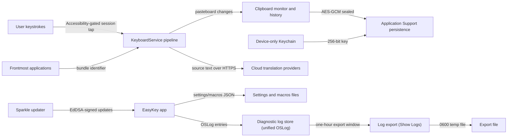

# Threat model

_Last reviewed: 2026-08-03_

EasyKey is a menu-bar utility that transforms keystrokes system-wide, keeps an
optional local clipboard history, and offers opt-in cloud translation. This
model covers the bounded data plane: the session keyboard event tap, the
clipboard capture and persistence pipeline, cloud translation, Keychain-held
secrets, local settings and log files, the update channel, and the login
helper. Data classes are classified in [data-handling.md](data-handling.md);
disclosure practice is governed by the [Security policy](../../SECURITY.md).

## Assets and trust boundaries

Five trust boundaries separate the assets above:

- **Accessibility boundary (user → event tap).** A session event tap
  (`CGEvent.tapCreate`, `.cgSessionEventTap`) is installed only after
  `AXIsProcessTrusted()` succeeds; the system prompt is raised by
  `requestAccessibilityPermission`, and `refreshPermission` tears the tap down
  the moment trust is revoked (`KeyboardEventTap.swift`, `KeyboardService.swift`).
  The tap listens for key down/up, flags, and mouse events
  (`KeyboardInputPipeline.makeEventMask`) and is installed and processing
  regardless of which application is frontmost; it bypasses processing only for
  applications on the compatibility ignored list and for foreign input sources
  when other-language support is off. This boundary protects keystroke content.
- **Process boundary (EasyKey → cloud providers).** Translation adapters build
  requests only from `ValidatedTranslationEndpoint` — HTTPS-only, no userinfo —
  and `HostSafety.validate` additionally rejects loopback, private, link-local,
  CGNAT, and multicast addresses after DNS resolution. Traffic runs over the
  system TLS stack through an ephemeral `URLSession` that stores no cookies or
  credentials (`TranslationProviding.swift`, `HostSafety.swift`).
- **Keychain boundary (OS → EasyKey).** Clipboard keys and translation
  credentials live in Keychain items created with
  `kSecAttrAccessibleWhenUnlockedThisDeviceOnly` and
  `kSecAttrSynchronizable = false`, so they cannot leave the device
  (`ClipboardKeyStore.swift`, `TranslationCredentialStore.swift`).
- **Disk boundary.** Persisted clipboard state is AES-GCM sealed with that
  keychain-held key; settings, macros, and smart-switch preferences are plain
  JSON that contains no credentials. Deleting persisted history removes the
  directory and the key (`ClipboardPersistence.swift`).
- **Update boundary.** Sparkle is configured with an HTTPS-only `SUFeedURL` and
  a pinned EdDSA public key (`SUPublicEDKey`); updates are EdDSA-signed, and the
  release publish workflow pins its Sparkle toolchain download by SHA256
  (`UpdateService.swift`, `Info.plist`, `Scripts/check-sparkle-pin.sh`).

## STRIDE applicability

| DFD element type | S | T | R | I | D | E |
|---|---|---|---|---|---|---|
| External entity | ✓ | N/A | ✓ | N/A | N/A | N/A |
| Process | ✓ | ✓ | ✓ | ✓ | ✓ | ✓ |
| Data store | N/A | ✓ | ✓ | ✓ | ✓ | N/A |
| Data flow | N/A | ✓ | N/A | ✓ | ✓ | N/A |

## STRIDE matrix

| Element | Type | S | T | R | I | D | E |
|---|---|---|---|---|---|---|---|
| User (keyboard operator) | external entity | examined-none-found | N/A | examined-none-found | N/A | N/A | N/A |
| Frontmost applications | external entity | T1 | N/A | examined-none-found | N/A | N/A | N/A |
| Cloud translation providers | external entity | T2 | N/A | examined-none-found | N/A | N/A | N/A |
| Keyboard event tap | process | examined-none-found | examined-none-found | examined-none-found | T3 | T8 | examined-none-found |
| Vietnamese engine pipeline | process | examined-none-found | examined-none-found | examined-none-found | examined-none-found | examined-none-found | examined-none-found |
| Clipboard monitor and history model | process | examined-none-found | examined-none-found | examined-none-found | T4 | T12 | examined-none-found |
| Translation adapters | process | examined-none-found | examined-none-found | examined-none-found | T6, T7 | examined-none-found | examined-none-found |
| Sparkle updater | process | T9 | T9 | examined-none-found | examined-none-found | examined-none-found | examined-none-found |
| Login helper | process | examined-none-found | examined-none-found | examined-none-found | examined-none-found | examined-none-found | T11 |
| Clipboard persistence store | data store | N/A | T5 | examined-none-found | T5 | examined-none-found | N/A |
| Keychain | data store | N/A | examined-none-found | examined-none-found | examined-none-found | examined-none-found | N/A |
| Settings and macros files | data store | N/A | examined-none-found | examined-none-found | examined-none-found | examined-none-found | N/A |
| Diagnostic log store | data store | N/A | examined-none-found | examined-none-found | examined-none-found | examined-none-found | N/A |
| Log export | process | examined-none-found | examined-none-found | examined-none-found | T10 | examined-none-found | examined-none-found |
| Source text flow | data flow | N/A | examined-none-found | N/A | T6 | examined-none-found | N/A |
| Update flow (appcast, DMG) | data flow | N/A | T9 | N/A | examined-none-found | examined-none-found | N/A |
| Pasteboard flow | data flow | N/A | examined-none-found | N/A | T4 | examined-none-found | N/A |

## Threat details

Each threat below has exactly one disposition tied to a testable control and a
statement of what evidence does not yet cover.

### T1 — Frontmost applications: spoofed source identity

**Threat:** A pasteboard change carries no trustworthy source attribution on
macOS; the ignored-applications filter relies on the frontmost application's
bundle identifier, so content copied from an ignored application can still be
captured when another application is frontmost at poll time.

**Disposition:** mitigate — sensitive-marker rejection
(`SensitivePasteboardMarkers`) runs before any payload byte is read and does
not depend on source identity (`ClipboardMonitor.swift:87-91`,
`PasteboardSnapshot.swift`); the ignored-applications filter is documented as
best effort and explicitly not a security boundary ([product overview](../product/overview.md)
Private by Design, [Privacy](data-handling.md)).

**Residual uncertainty:** source attribution cannot be made trustworthy from
within the app; the residual exposure is capture of an excluded item on the
local machine.

### T2 — Cloud translation providers: endpoint impersonation

**Threat:** A tampered hostname or a malicious endpoint could capture source
text and API credentials.

**Disposition:** mitigate — every adapter restricts itself to
`ValidatedTranslationEndpoint` (HTTPS-only, no userinfo), `HostSafety` rejects
loopback and private addresses at DNS resolution time, and credentials are sent
only to that validated origin over the system TLS stack via the ephemeral
session.

**Residual uncertainty:** `HostSafety` resolves addresses at request time;
address-level rebinding within the OS resolver is outside the app's control.

### T3 — Keyboard event tap: keystroke disclosure

**Threat:** The session event tap observes all keystrokes system-wide,
including passwords and text never intended for EasyKey.

**Disposition:** mitigate — the tap is installed only while Accessibility is
granted, processes events in memory, records only latency and disposition
diagnostics (never content), and is torn down when permission is revoked or the
tap is disabled by the system (`refreshPermission`, `recoverTapAfterDisable`);
self-synthesized events are marked and skipped via `KeySynthesizer.isSelfPosted`
to prevent loops.

**Residual uncertainty:** any process with Accessibility can observe
keystrokes on macOS; EasyKey cannot reduce that OS-level exposure, and the tap
must remain session-wide for the product to work in any frontmost application.

### T4 — Clipboard capture: sensitive content disclosure

**Threat:** Clipboard content is captured without user awareness, including
passwords or transient selections from password managers.

**Disposition:** mitigate — capture is off by default
(`ClipboardOptions.isCaptureEnabled = false`); the monitor rejects
Concealed/Transient/AutoGenerated and password-manager marker types before
reading payloads; history is memory-only unless persistence is explicitly
enabled; per-event (10 MiB) and retained (100 MiB) byte caps apply.

**Residual uncertainty:** the markers are cooperative conventions honored by
major password managers; a producer that uses no marker can be captured.

### T5 — Persisted clipboard: tampering and disclosure at rest

**Threat:** An attacker with file access could modify or read persisted
clipboard history.

**Disposition:** mitigate — manifest and payloads are sealed with AES-GCM
(authenticated encryption) under a 256-bit key stored in a device-only,
non-synchronizing Keychain item; reads are bounded by file-size checks and any
authentication failure aborts the load (`ClipboardPersistence.swift`,
`ClipboardKeyStore.swift`).

**Residual uncertainty:** the key's protection is the OS Keychain with
`WhenUnlockedThisDeviceOnly`; compromise of the logged-in user session that
unlocks the Keychain exposes both key and ciphertext.

### T6 — Cloud translation: non-surface text disclosure

**Threat:** General keyboard input is uploaded as translation source text.

**Disposition:** mitigate — only EasyKey translation surfaces (translation
editor, menu popover, Option+A panel) submit `request.sourceText`; requests go
directly to the chosen provider with no intermediate service; the ephemeral
session stores no cookies, cache, or credentials; each provider shows a
first-use disclosure prompt before the first request
(`AppTranslationRuntime.swift`, `TranslationDisclosureController`).

**Residual uncertainty:** provider-side handling and retention of submitted
text are governed by provider terms, outside this repository.

### T7 — Translation credentials: disclosure

**Threat:** API keys leak via logs, disk files, or iCloud synchronization.

**Disposition:** mitigate — credentials live only in Keychain items created
device-only and non-synchronizing; the settings JSON on disk contains no
credential fields; log exports whitelist app/keyboard/settings categories
(translation excluded) and pattern-redact credential-like strings.

**Residual uncertainty:** redaction is pattern-based; a credential format not
covered by the patterns could pass through an export, though no code path
writes credentials to logs.

### T8 — Keyboard event tap: denial of service

**Threat:** The system disables the tap (timeout or user input) or typing stops
transforming silently.

**Disposition:** mitigate — `recoverTapAfterDisable` tears down and reinstalls
the tap; health state (`.active`, `.degraded`, `.requestingPermission`,
`.failed`) is surfaced in the menu bar and System Health card; workspace
sleep/wake observers re-check permission and re-install; the emergency-pause
shortcut is a deliberate user control.

**Residual uncertainty:** macOS may throttle taps that repeatedly exceed
latency thresholds; the app does not assert real-time guarantees.

### T9 — Update channel: spoofed feed or tampered update

**Threat:** A malicious appcast or DMG delivers attacker code.

**Disposition:** mitigate — Sparkle requires an HTTPS-only `SUFeedURL` and a
pinned `SUPublicEDKey` (EdDSA) in `Info.plist`; release DMGs are EdDSA-signed in
the publish workflow, which pins its Sparkle toolchain download by SHA256 and
is enforced by `Scripts/check-sparkle-pin.sh`.

**Residual uncertainty:** feed URL and public key are build-time settings; a
compromise of the release signing key material is outside the app.

### T10 — Log export: credential and content disclosure

**Threat:** A log export contains API keys or clipboard text.

**Disposition:** mitigate — exports are limited to a one-hour window and 2000
entries across app/keyboard/settings categories only; `LogExporter.redact`
removes credential-like patterns; output files are written with 0600
permissions; log calls use `privacy: .private` for debug/info/notice messages,
and no code path logs clipboard content.

**Residual uncertainty:** redaction is pattern-based; OSLog entries older than
the lookback window or from other subsystems are not included.

### T11 — Login helper: privilege or behavior abuse

**Threat:** A replaced or misplaced login helper could be launched at login and
impersonate EasyKey.

**Disposition:** mitigate — the helper validates its host bundle URL shape
(four-level path walk, `.app` extension, bundle identifier `one.ifelse.easykey`),
checks whether the host is already running, compares launch-time code-signing
team identifier in non-debug builds, and self-terminates via a 3-second
watchdog (`EasyKeyLoginHelper/main.swift`); registration runs only through
`SMAppService.loginItem` register/unregister (`LoginItemController.swift`).

**Residual uncertainty:** the team-identifier comparison uses a build-time
constant; with the placeholder default the check is inert until a real team
identifier is substituted at build time.

### T12 — Clipboard capture: resource exhaustion

**Threat:** Rapid or oversized copy activity exhausts memory or disk.

**Disposition:** mitigate — per-event cap of 10 MiB, retained cap of 100 MiB
(`ClipboardLimits`), pruning by age and count with a hard pinned-entry cap,
rejection of candidates that exceed limits, and capture off by default.

**Residual uncertainty:** caps are applied at capture and load time only; an
attack that saturates the system pasteboard itself is outside the app.

## Accepted residual risk

None accepted based on available evidence.

The two bounded exposures above — cooperative sensitive-marker rejection (T4)
and best-effort ignored-applications filtering (T1) — are documented product
limits with working mitigations, not formally accepted residual risks, and
carry the residual uncertainty stated in their entries.

Data classifications: see [data-handling.md](data-handling.md). Disclosure
process: see [Security policy](../../SECURITY.md).
